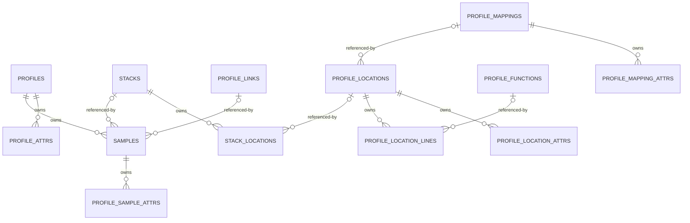

# OTAP Profiles Data Model Proposal

<!-- markdownlint-disable MD060 -->

## Status

This document defines the experimental Apache Arrow representation implemented
by the stacked OTAP Profiles work. The schema and transport remain unstable
while the upstream Profiles signal is Alpha.

The proposal targets the Alpha
`opentelemetry.proto.profiles.v1development` model as it exists at the time of
review. That package is explicitly unstable. Implementation must pin a specific
upstream protobuf revision and repeat the compatibility analysis before schemas
or payload type numbers are committed.

Implementation step 1 pins `opentelemetry-proto` commit
`7c63f7b8b69e83bdda071a70898cd8a9f4ec77a2` and regenerates the Rust Profiles
types from that revision. The compatibility analysis below records the drift
from the previously checked-in generated types; every listed row is resolved by
that pin. Supporting an older Collector-compatible revision still requires an
explicit compatibility layer.

The resolved drift was material:

| Previously checked-in generated type | Pinned upstream model |
|---|---|
| repeated `Profile.sample_type` | singular `Profile.sample_type` |
| `Profile.location_indices` | removed; replaced by the stack dictionary |
| `Profile.comment_strindices` | removed |
| `Profile.default_sample_type_index` | removed |
| signed `time_nanos` and `duration_nanos` | unsigned `time_unix_nano` and `duration_nano` |
| separate `AttributeUnit` | `KeyValueAndUnit` in the attribute dictionary |
| `ValueType.aggregation_temporality` | removed |
| sample location range | `Sample.stack_index` |
| optional `Sample.link_index` | zero-index-means-null `link_index` |
| mapping capability flags | removed |
| `Location.is_folded` | removed |
| optional `Location.mapping_index` | zero-index-means-null `mapping_index` |
| no `Stack` message | `Stack` and `ProfilesDictionary.stack_table` |

The proposed schemas follow the pinned upstream column on the right and must
not combine fields from different revisions.

## Goals

The Profiles representation should:

- support semantic OTLP Profiles -> OTAP -> OTLP round trips;
- efficiently represent continuous profiles produced by SDK and host-level
  profilers, including the OpenTelemetry eBPF profiler;
- preserve resources, instrumentation scopes, profiles, samples, stacks,
  locations, lines, functions, mappings, links, attributes, value types,
  timestamps, and original payloads;
- make common profile operations, such as filtering samples and redacting
  attributes or source information, explicit and safe;
- preserve reference integrity after filtering, partitioning, concatenation,
  and batching;
- support vectorized processing without requiring processors to understand
  protobuf dictionary indexes;
- use bounded-width identifiers and reject overflows instead of truncating;
- fit OTAP's existing root-and-related-record-batch model; and
- permit adaptive Arrow schemas and IPC dictionary encoding without making
  logical identity depend on an IPC stream dictionary.

## Non-goals

The initial schema does not attempt to:

- preserve byte-for-byte protobuf encoding;
- preserve unknown protobuf fields after a protobuf decode;
- define the Arrow payload type enum values or OTAP gRPC service changes;
- define a stable Profiles API while the upstream signal is Alpha;
- make dictionaries or entity identifiers valid across independent OTAP
  messages;
- support mutation of `original_payload` when another profile field changes;
- define the configuration language for profile processors; or
- prove a compression or processing performance improvement without
  benchmarks.

## Source Model and Compatibility Boundary

The current OTLP Profiles model has two top-level envelopes:

- `ProfilesData`, used for storage or embedding in a non-OTLP protocol; and
- `ExportProfilesServiceRequest`, used by OTLP.

Both carry a sequence of `ResourceProfiles` and one shared
`ProfilesDictionary`. The dictionary contains mappings, locations, functions,
links, strings, attributes, and stacks. Profiles and dictionary entities refer
to dictionary entries by integer index. Index zero is reserved for the zero
value of every dictionary table.

The logical reference graph is:

```text
ResourceProfiles
  -> ScopeProfiles
    -> Profile
      -> Sample
        -> Stack
          -> Location
            -> Mapping
            -> Line
              -> Function
        -> Link

Profile, Sample, Mapping, and Location
  -> Attribute

ValueType, Mapping, Function, and Attribute
  -> String

Resource and Scope attributes
  -> String
```

The last edge is specific to Profiles even though resources and scopes use the
stable common data model. `KeyValue.key_strindex` and
`AnyValue.string_value_strindex` refer to the Profiles string table. The latter
may appear recursively inside `ArrayValue` and `KeyValueList`. An OTLP -> OTAP
encoder must resolve all such references before it encodes an attribute into
the existing OTAP columns, including the CBOR `ser` representation of complex
`AnyValue` values. An unresolved string index is invalid; it must never be
copied into `ser` because the originating Profiles dictionary will no longer be
available.

The protobuf dictionary is a transport representation, not a suitable OTAP
identity model. Its indexes change when two requests are concatenated or when
orphaned entries are removed. OTAP therefore uses explicit batch-local entity
IDs and materialized string values. Conversion back to OTLP rebuilds a valid
dictionary and rewrites every index.

Semantic round trip means that all defined OpenTelemetry fields and references
have equivalent meaning after conversion. It does not mean:

- identical protobuf bytes;
- identical dictionary ordering or duplicate dictionary entries;
- preservation of orphaned dictionary entries;
- preservation of protobuf field presence where the Profiles specification
  says an unset field is equivalent to its default; or
- preservation of unknown protobuf fields discarded by the protobuf runtime.

Canonical OTAP also does not distinguish a null dictionary reference from an
explicit reference to a structurally zero dictionary entry. Index zero means
null in the Profiles model. OTLP -> OTAP therefore maps it to a null foreign
key, never to an entity row. An OTAP entity that is structurally equal to its
protobuf dictionary's reserved zero value is non-canonical and invalid. This
rule makes OTAP -> OTLP -> OTAP a stable canonicalization.

Applications that require fidelity to a source format such as JFR, pprof, or
Linux perf should carry `original_payload_format` and `original_payload`.
Processors must treat those bytes as an independent source artifact. Mutating
the normalized profile does not rewrite the original payload.

## Alternatives Considered

### Normalized record batches

Every logical entity is represented by rows in a dedicated record batch.
Relationships use explicit IDs and foreign-key columns.

Advantages:

- filtering and redaction operate on focused columns;
- shared entities are represented once;
- reference validation is explicit;
- relational and DataFusion processing is natural;
- child tables match existing OTAP conventions; and
- compaction can be implemented as graph reachability followed by ID remapping.

Costs:

- the signal requires more related record batches than logs or traces;
- reconstruction involves joins or indexed lookups;
- concatenation must remap batch-local IDs; and
- profile operations must preserve ordering columns for ordered protobuf lists.

### Nested lists and structs

Each profile could be one Arrow row containing nested samples, stacks,
locations, functions, mappings, and attributes.

Advantages:

- ownership and batch boundaries are visually direct;
- a complete profile can be sliced as one root row; and
- OTLP reconstruction requires less relational assembly.

Costs:

- shared stack and symbol data is duplicated or still needs side tables;
- filtering deeply nested samples requires rebuilding multiple offset buffers;
- selective projection and redaction are more complex;
- large nested values make admission accounting and row limits less useful;
- Parquet and query-engine access become less predictable; and
- mutation can copy large portions of an otherwise unchanged profile.

### Hybrid fact and dimension batches

Profiles and samples are fact records. Stack and symbol information is kept in
normalized dimension batches. Small ordered per-row sequences, such as sample
values and timestamps, remain Arrow lists. Attributes are materialized into
owner-specific related batches.

Advantages:

- preserves normalized shared stack and symbol entities;
- avoids a row for every primitive sample observation;
- makes sample filtering and attribute redaction direct;
- retains list ordering where it is semantically relevant; and
- follows existing OTAP root/related-batch and attribute conventions.

Costs:

- uses both list processing and relational processing;
- compaction still requires graph traversal; and
- profiles with extremely large observation lists require explicit list-value
  limits.

### Recommendation

Use the hybrid representation. `PROFILES` is the root batch. Samples, stacks,
stack locations, locations, lines, functions, mappings, links, value types, and
attributes are related batches. Primitive sample values and timestamps remain
lists on a sample row.

The recommendation must be validated against real eBPF, pprof, JFR, allocation,
and off-CPU datasets before it becomes normative. In particular, benchmarks
should compare list columns with a fully normalized per-observation batch.

## Identity and Reference Rules

All IDs in this proposal are logical OTAP IDs, not Arrow row numbers and not
protobuf dictionary indexes.

- IDs are unique within one BatchArrowRecords (BAR). IDs may be reused by a
  later BAR in the same OTAP stream.
- Zero is reserved as an absent reference where the upstream model uses a zero
  dictionary index. Implementations should not emit entity rows with ID zero.
- An ID remains valid if rows are reordered within a record batch.
- IPC dictionary replacement or reset does not affect entity IDs.
- A processor may leave gaps in ID sequences.
- Encoders may assign dense IDs for efficiency but consumers must not require
  density.
- Concatenating OTAP messages requires allocating non-overlapping IDs and
  rewriting all affected foreign keys.
- Partitioning must copy the transitive closure of referenced dimension rows
  into each output and remap IDs in that output. Because closures can be copied
  into multiple outputs, partitioning is not size-preserving. The processor
  must reapply row, byte, and memory limits to every output and to the aggregate
  set of outputs retained concurrently before publishing them.
- Orphaned dimension rows have no semantic meaning and may be removed.
- Duplicate dimension rows may be deduplicated if all references are rewritten
  and the operation has no observable semantic effect.
- Dimension equality is structural. For example, two `STACKS` rows are equal
  only when their ordered `STACK_LOCATIONS` children identify equal locations;
  their empty root rows alone do not establish equality.
- A dictionary-derived entity that is structurally equal to its reserved
  protobuf zero value must not have an OTAP row. References to index zero become
  null foreign keys.
- A missing, zero-forbidden, or type-invalid reference rejects the Profiles
  message. It must not be silently converted to another entity.

`UInt32` is proposed for profile-local entity IDs. Producers must reject a
message that cannot be represented without exceeding `UInt32::MAX`. Limits
configured below that maximum should normally reject oversized messages much
earlier.

Sample identity is defined by the tuple `(stack, attribute set, link)` within a
profile. Attribute order is not part of identity: processors compare the set of
materialized `(key, value, unit)` tuples. The `values` and timestamps are
observations associated with that identity. Multiple rows with equal identity
are semantically permitted, and an encoder or graph-aware merge may combine
them by appending observations while preserving value/timestamp alignment.
Combining is never based on sample ID or attribute ordinal.

Resource and scope identity should reuse the conventions used by existing OTAP
root batches. The `PROFILES` root carries `resource.id` and `scope.id` values,
and `RESOURCE_ATTRS` and `SCOPE_ATTRS` refer to those IDs.

### BAR-scoped sharing

`STACKS`, `PROFILE_LOCATIONS`, `PROFILE_FUNCTIONS`, `PROFILE_MAPPINGS`, and
`PROFILE_LINKS` have no `parent_id`. They are dictionary dimensions shared by
all profiles, scopes, and resources in one BAR, matching the scope of the OTLP
`ProfilesDictionary`. A stack may therefore be referenced by samples belonging
to different profiles and resources in the same BAR.

This is an explicit exception to the usual OTAP rule that a related batch's
`parent_id` references a root or parent batch. It resembles the special
resource and scope identity rules, but introduces arbitrary many-to-one
foreign keys. Validation, processing, compaction, partitioning, and merging
must operate over the complete BAR rather than treating each root profile as a
self-contained graph.



The `o|` side represents a nullable reference. The diagram omits resource,
scope, value-type, and attribute-string relationships for readability.

## Proposed Record Batches

The tables below specify logical full schemas using the same columns as the
payload tables in the OTAP specification. OTAP adaptive schemas may omit
optional columns whose values are absent. A dictionary variant is an Arrow IPC
physical encoding; it never establishes logical identity or a foreign key.

The first schema version uses `plain` transport encoding except for sorted
`parent_id` columns, which may use `delta`. It does not dictionary-encode
non-parent foreign keys because existing OTAP ID rules define dictionary
variants only for `parent_id`. A future protocol revision may define that third
category, including key widths and overflow behavior, after benchmarks justify
it.

### PROFILES (root)

One row represents one OpenTelemetry `Profile` and its resource and scope
context.

| Field | Arrow type | Dict variants | Required | Transport optimization | Category | Description |
|---|---|---|---:|---|---|---|
| `id` | UInt32 | - | Yes | `plain` | id | BAR-local profile ID; unique and nonzero |
| `resource.id` | UInt16 | - | No | `plain` | resource | Resource ID used by `RESOURCE_ATTRS` |
| `resource.schema_url` | Utf8 | Dict(u8), Dict(u16) | No | `plain` | resource | Resource schema URL |
| `resource.dropped_attributes_count` | UInt32 | - | No | `plain` | resource | Dropped resource attributes |
| `scope.id` | UInt16 | - | No | `plain` | scope | Scope ID used by `SCOPE_ATTRS` |
| `scope.name` | Utf8 | Dict(u8), Dict(u16) | No | `plain` | scope | Instrumentation scope name |
| `scope.version` | Utf8 | Dict(u8), Dict(u16) | No | `plain` | scope | Instrumentation scope version |
| `scope.dropped_attributes_count` | UInt32 | - | No | `plain` | scope | Dropped scope attributes |
| `schema_url` | Utf8 | Dict(u8), Dict(u16) | No | `plain` | data | Scope Profiles schema URL |
| `time_unix_nano` | UInt64 | - | Yes | `plain` | data | Collection time as UNIX nanoseconds |
| `duration_nano` | UInt64 | - | Yes | `plain` | data | Duration in nanoseconds; may be zero |
| `period` | Int64 | - | No | `plain` | data | Sampling period |
| `profile_id` | FixedSizeBinary(16) | - | No | `plain` | data | Nonzero OpenTelemetry profile ID |
| `dropped_attributes_count` | UInt32 | - | No | `plain` | data | Dropped profile attributes |
| `original_payload_format` | Utf8 | Dict(u8), Dict(u16) | No | `plain` | data | Format paired with `original_payload` |
| `original_payload` | LargeBinary | - | No | `plain` | data | Original source payload |

The normative field comments in the current
[Profiles model][profile-field-rules] require
`original_payload_format` and `original_payload` to either both be set or both
be unset. It also defines a present `profile_id` as exactly 16 bytes and treats
an all-zero ID as invalid.

### PROFILE_VALUE_TYPES

One row represents a nonzero sample or period `ValueType`. A child batch is
preferred over fixed root columns because historical Alpha revisions represented
sample types differently.

| Field | Arrow type | Dict variants | Required | Transport optimization | Category | Description |
|---|---|---|---:|---|---|---|
| `parent_id` | UInt32 | Dict(u8), Dict(u16) | Yes | `delta` | parent_id | Foreign key to `PROFILES.id` |
| `role` | UInt8 | - | Yes | `plain` | data | 0 = sample, 1 = period |
| `type` | Utf8 | Dict(u8), Dict(u16) | Yes | `plain` | data | Materialized type string; empty is valid |
| `unit` | Utf8 | Dict(u8), Dict(u16) | Yes | `plain` | data | Materialized unit string; empty is valid |

There must be at most one row of each role per profile, and values outside 0
and 1 are invalid. An absent row decodes to the protobuf zero `ValueType`.
Canonical OTAP omits a row whose type and unit are both empty. A revision with
multiple sample types requires an explicit schema revision.

### SAMPLES

One row represents one OpenTelemetry `Sample`.

| Field | Arrow type | Dict variants | Required | Transport optimization | Category | Description |
|---|---|---|---:|---|---|---|
| `id` | UInt32 | - | Yes | `plain` | id | BAR-local sample ID; unique and nonzero |
| `parent_id` | UInt32 | Dict(u8), Dict(u16) | Yes | `delta` | parent_id | Foreign key to `PROFILES.id` |
| `stack_id` | UInt32 | - | No | `plain` | foreign_key | Foreign key to `STACKS.id`; index zero becomes null |
| `link_id` | UInt32 | - | No | `plain` | foreign_key | Foreign key to `PROFILE_LINKS.id`; index zero becomes null |
| `values` | LargeList(Int64) | - | Yes | `plain` | data | Ordered measured values; may be empty |
| `timestamps_unix_nano` | LargeList(UInt64) | - | Yes | `plain` | data | Ordered UNIX-nanosecond timestamps; may be empty |

At least one of `values` or `timestamps_unix_nano` must be non-empty. When both
are non-empty, they must have equal length and elements at the same index refer
to the same event. Observation reduction must remove `values[i]` and
`timestamps_unix_nano[i]` together. List lengths and cumulative child-buffer
offsets must fit configured limits and Arrow offset types.

### STACKS

One row identifies one shared stack. Stack membership is represented separately
so frame order survives sorting and filtering.

| Field | Arrow type | Dict variants | Required | Transport optimization | Category | Description |
|---|---|---|---:|---|---|---|
| `id` | UInt32 | - | Yes | `plain` | id | BAR-local stack ID; unique and nonzero |

### STACK_LOCATIONS

One row represents one ordered location reference in a stack.

| Field | Arrow type | Dict variants | Required | Transport optimization | Category | Description |
|---|---|---|---:|---|---|---|
| `parent_id` | UInt32 | Dict(u8), Dict(u16) | Yes | `delta` | parent_id | Foreign key to `STACKS.id` |
| `ordinal` | UInt32 | - | Yes | `plain` | ordering | Frame order; zero is the leaf frame |
| `location_id` | UInt32 | - | No | `plain` | foreign_key | Foreign key to `PROFILE_LOCATIONS.id`; index zero becomes null |

`(parent_id, ordinal)` is unique. Ordinals for one stack are contiguous from
zero unless a later specification explicitly permits gaps. A null
`location_id` preserves a legal protobuf zero index at that stack position; it
does not resolve to a `PROFILE_LOCATIONS` row.

### PROFILE_LOCATIONS

One row represents one shared code location.

| Field | Arrow type | Dict variants | Required | Transport optimization | Category | Description |
|---|---|---|---:|---|---|---|
| `id` | UInt32 | - | Yes | `plain` | id | BAR-local location ID; unique and nonzero |
| `mapping_id` | UInt32 | - | No | `plain` | foreign_key | Foreign key to `PROFILE_MAPPINGS.id`; index zero becomes null |
| `address` | UInt64 | - | Yes | `plain` | data | Instruction address; zero means unavailable |

If a mapping is present and its range is known, validation should check the
upstream address-range requirements without inventing an address when none is
available.

### PROFILE_LOCATION_LINES

One row represents one line entry for a location. Multiple rows preserve
inline-call order.

| Field | Arrow type | Dict variants | Required | Transport optimization | Category | Description |
|---|---|---|---:|---|---|---|
| `parent_id` | UInt32 | Dict(u8), Dict(u16) | Yes | `delta` | parent_id | Foreign key to `PROFILE_LOCATIONS.id` |
| `ordinal` | UInt32 | - | Yes | `plain` | ordering | Inline-line order |
| `function_id` | UInt32 | - | No | `plain` | foreign_key | Foreign key to `PROFILE_FUNCTIONS.id`; index zero becomes null |
| `line` | Int64 | - | Yes | `plain` | data | One-based source line; zero means unset |
| `column` | Int64 | - | Yes | `plain` | data | One-based source column; zero means unset |

`(parent_id, ordinal)` is unique and preserves the order required to interpret
inlined functions. A null `function_id` preserves `function_index = 0`. This is
distinct from a nonzero reference to a function row, and no structurally zero
function row may be emitted.

### PROFILE_FUNCTIONS

One row represents one shared function.

| Field | Arrow type | Dict variants | Required | Transport optimization | Category | Description |
|---|---|---|---:|---|---|---|
| `id` | UInt32 | - | Yes | `plain` | id | BAR-local function ID; unique and nonzero |
| `name` | Utf8 | Dict(u8), Dict(u16) | No | `plain` | data | Human-readable function name |
| `system_name` | Utf8 | Dict(u8), Dict(u16) | No | `plain` | data | Linker or runtime function name |
| `filename` | Utf8 | Dict(u8), Dict(u16) | No | `plain` | data | Source filename |
| `start_line` | Int64 | - | No | `plain` | data | Start line; zero/unset is absent |

The current upstream model requires at least one of `name`, `system_name`, or
`filename`. Validation follows the pinned model if that invariant changes.

### PROFILE_MAPPINGS

One row represents one mapped executable image or virtual mapping.

| Field | Arrow type | Dict variants | Required | Transport optimization | Category | Description |
|---|---|---|---:|---|---|---|
| `id` | UInt32 | - | Yes | `plain` | id | BAR-local mapping ID; unique and nonzero |
| `memory_start` | UInt64 | - | Yes | `plain` | data | Inclusive mapping start address |
| `memory_limit` | UInt64 | - | Yes | `plain` | data | Exclusive mapping limit address |
| `file_offset` | UInt64 | - | Yes | `plain` | data | File offset at `memory_start` |
| `filename` | Utf8 | Dict(u8), Dict(u16) | No | `plain` | data | Materialized mapped object name |

When both addresses are nonzero, `memory_limit` must not be less than
`memory_start`.

### PROFILE_LINKS

One row represents one shared trace/span correlation link.

| Field | Arrow type | Dict variants | Required | Transport optimization | Category | Description |
|---|---|---|---:|---|---|---|
| `id` | UInt32 | - | Yes | `plain` | id | BAR-local link ID; unique and nonzero |
| `trace_id` | FixedSizeBinary(16) | - | Yes | `plain` | data | Valid OpenTelemetry trace ID |
| `span_id` | FixedSizeBinary(8) | - | Yes | `plain` | data | Valid OpenTelemetry span ID |

Invalid all-zero IDs are rejected according to the pinned Profiles and Trace
specifications rather than converted to a null reference.

### Profile-owned attributes

Profile dictionary attributes include a unit and may be referenced by profiles,
samples, mappings, and locations. OTAP materializes them into four owner-specific
batches:

- `PROFILE_ATTRS`, whose `parent_id` refers to `PROFILES.id`;
- `PROFILE_SAMPLE_ATTRS`, whose `parent_id` refers to `SAMPLES.id`;
- `PROFILE_MAPPING_ATTRS`, whose `parent_id` refers to
  `PROFILE_MAPPINGS.id`; and
- `PROFILE_LOCATION_ATTRS`, whose `parent_id` refers to
  `PROFILE_LOCATIONS.id`.

Each batch extends the existing OTAP attribute schema with a nullable `unit`
column:

| Field | Arrow type | Dict variants | Required | Transport optimization | Category | Description |
|---|---|---|---:|---|---|---|
| `parent_id` | UInt32 | Dict(u8), Dict(u16) | Yes | `plain` | parent_id | Foreign key to the owner batch |
| `ordinal` | UInt32 | - | Yes | `plain` | ordering | Reference order for deterministic output |
| `key` | Utf8 | Dict(u8), Dict(u16) | Yes | `plain` | data | Attribute key |
| `type` | UInt8 | - | Yes | `plain` | data | Existing OTAP AnyValue discriminator |
| `str` | Utf8 | Dict(u8), Dict(u16) | No | `plain` | data | String value |
| `int` | Int64 | - | No | `plain` | data | Integer value |
| `double` | Float64 | - | No | `plain` | data | Floating-point value |
| `bool` | Boolean | - | No | `plain` | data | Boolean value |
| `bytes` | Binary | - | No | `plain` | data | Byte value |
| `ser` | Binary | - | No | `plain` | data | CBOR-serialized complex AnyValue |
| `unit` | Utf8 | Dict(u8), Dict(u16) | No | `plain` | data | UCUM unit or absent |

For one owner, keys must satisfy the Profiles attribute-key uniqueness rule.
An OTLP encoder may deduplicate identical key/value/unit tuples into the
protobuf attribute dictionary. Arrow IPC dictionary encoding of `key`, `str`,
or `unit` is independent from that operation.

Resource and scope attributes continue to use the existing `RESOURCE_ATTRS`
and `SCOPE_ATTRS` payload types and do not acquire a unit column. Their
Profiles-only string indexes must be recursively resolved to inline keys and
values before those existing OTAP batches, including `ser`, are constructed.

Profile-owned attribute batches use `plain` transport encoding initially.
Extending attribute quasi-delta encoding requires a protocol change that adds
`unit` to the equality tuple `(type, key, active value, unit)`. Without `unit`,
rows that differ only by unit could be incorrectly grouped.

## Ordering

OTAP IDs do not encode order. An explicit `ordinal` is required for locations
within a stack and inline lines within a location because their order affects
meaning. Attribute ordinals support deterministic reconstruction but do not
affect sample identity. Sample order and protobuf dictionary order are not
semantic and are not preserved.

Dictionary table ordering is not semantic and is not preserved. Encoders should
produce deterministic dictionaries by traversing roots by ID and ordered child
rows by `(parent_id, ordinal)`, assigning the zero entry first, and assigning an
index on first encounter. Implementations may choose a different deterministic
strategy if semantic equivalence tests do not depend on dictionary order.

## Conversion from OTLP Profiles

An OTLP -> OTAP encoder should perform these bounded stages:

1. Validate configured message, profile, sample, list-element, dictionary, and
   byte-size limits before allocating output proportional to untrusted counts.
2. Validate the dictionary zero entries and every referenced index.
3. Allocate OTAP IDs for nonzero mappings, locations, functions, links, stacks,
   profiles, and samples.
4. Recursively resolve every Profiles string-table reference, including those
   in resource and scope attribute keys and nested `AnyValue` values, then
   materialize strings into their logical columns.
5. Expand attribute references into owner-specific attribute rows, preserving
   key uniqueness and unit values.
6. Emit dimensions and ordered relationship rows.
7. Emit root profiles and sample facts.
8. Validate foreign keys and required pairs such as original payload fields.

No emitted `ser` value may contain an unresolved `string_value_strindex` or
`key_strindex`. The encoder may omit orphaned protobuf dictionary entries
because the Profiles model gives them no observable meaning. It may deduplicate
equal entries only
when all resulting references retain the same meaning.

The implementation must use checked arithmetic for:

- protobuf indexes;
- Arrow offsets;
- row counters and ID allocation;
- timestamp plus duration calculations;
- cumulative list lengths; and
- admission-control byte accounting.

Malformed input returns an error for the whole Profiles payload in the first
implementation. OTLP defines `ExportProfilesPartialSuccess.rejected_profiles`,
but partial rejection requires a later design because profiles share one
dictionary. That design must define whether the count is taken before or after
sample-identity combining and how an OTLP profile count maps to OTAP's
BAR-granularity `BatchStatus`. Until then, conversion either accepts the whole
request or fails it and never returns partial success.

## Conversion to OTLP Profiles

An OTAP -> OTLP encoder should:

1. Validate schemas, required columns, ID uniqueness, foreign keys, ordinals,
   and list invariants.
2. Traverse reachable entities from the selected root profiles.
3. Create every protobuf dictionary with the required zero value at index zero.
4. Intern materialized strings and attribute key/value/unit tuples. Resource
   and scope attributes may be re-interned with `key_strindex` and recursively
   generated `string_value_strindex` references, or emitted as inline strings;
   both are semantically equivalent. The initial encoder emits inline strings
   there and uses references only where the Profiles dictionary requires them.
5. Intern mappings, functions, locations, links, and stacks after their
   dependencies have indexes.
6. Rewrite OTAP IDs to protobuf dictionary indexes.
7. Reassemble samples in `SAMPLES.id` order, profiles in `PROFILES.id` order,
   and ordered children by `(parent_id, ordinal)`.
8. Emit the dictionary in the pinned `ProfilesData` or
   `ExportProfilesServiceRequest` envelope.

The encoder must not infer missing referenced entities. It must reject dangling
references and duplicate `(parent_id, ordinal)` values. Empty optional strings
and absent fields follow the pinned Profiles equivalence rules.

## Processing Semantics

### Attribute redaction

Attribute mutation is global to the referenced owner. The ownership categories
are:

- `PROFILE_ATTRS` and `PROFILE_SAMPLE_ATTRS` are local to one profile or sample;
- `RESOURCE_ATTRS` and `SCOPE_ATTRS` may be shared by multiple profile roots
  through `resource.id` and `scope.id`; and
- `PROFILE_MAPPING_ATTRS` and `PROFILE_LOCATION_ATTRS` belong to BAR-scoped
  shared dimensions and may affect many stacks, samples, and profiles.

Delete, replace, hash, allowlist, and denylist operations do not mechanically
require foreign-key changes when they intentionally apply to every reference to
an owner. A processor must not present mapping, location, resource, or scope
attribute mutation as selection-local merely because the attribute row itself
has one `parent_id`.

A mutation intended for only a subset of the profiles or samples reaching a
shared owner requires the copy-on-write procedure below. Changing resource or
scope attributes for a subset may require allocating a new resource or scope
ID and, if the selection divides samples within one profile, splitting that
profile and its samples. An initial processor may reject selection-local
resource, scope, mapping, or location mutations rather than implement an
unbounded split.

An implementation must maintain unique keys for each owner. Hashing or replacing
keys can create a collision and therefore requires an explicit collision policy;
silently retaining two values for one key is invalid.

### Shared-entity mutation and copy-on-write

Functions, mappings, locations, stacks, and links are shared across the BAR.
Mutating one row intentionally changes every path that references it. A
processor must expose whether an operation is global to the owner or local to a
selected set of samples.

Selection-local mutation walks against the foreign-key direction through
referrers, not through descendants. For example, redacting function `F` for a
selected sample set requires the processor to:

1. clone `F` with a fresh function ID and apply the redaction;
2. clone each selected `PROFILE_LOCATION_LINES` row that refers to `F`, along
   with its owning location and all other line and location-attribute rows
   needed to preserve that location;
3. clone each selected stack and all its `STACK_LOCATIONS` rows, replacing only
   the cloned location references; and
4. repoint only selected `SAMPLES.stack_id` values to the cloned stacks.

For location or mapping attribute mutation, the walk begins at that owner and
continues through locations, stack-location edges, stacks, and selected
samples. Paths used by non-selected samples retain their original entities.

Consider location `L` with inline functions `[f1, f2]`, stacks
`S1 = [L, A]` and `S2 = [L, B]`, and samples `s1 -> S1` and `s2 -> S2`.
Redacting `f1` only for `s1` produces `f1'`, a complete cloned location `L'`,
and `S1'`; it repoints `s1` to `S1'`. `s2`, `S2`, `L`, and `f1` remain
unchanged.

### Reverse indexes and fan-out limits

Selection-local copy-on-write requires BAR-local reverse indexes for at least:

- function -> location-line rows;
- mapping -> locations;
- location -> stack-location rows;
- stack -> samples;
- link -> samples; and
- resource/scope identity -> profile roots.

Indexes may be built lazily for one processor invocation or maintained as part
of a validated view. Their entries, backing allocations, and construction work
count against the processor's memory and work budgets. They must contain no
more entries than the corresponding bounded foreign-key edge sets.

Worst-case fan-out is linear in the BAR: changing a widely shared function can
clone nearly every location, line, stack edge, and stack. Before mutation, a
processor must estimate or incrementally account for output rows and bytes,
enforce configured clone and amplification limits, and fail without publishing
a partial graph when a limit is exceeded. Selection-local mutation is an
optional expensive capability, not an assumed constant-time operation.

### Sample filtering and reduction

Dropping a `SAMPLES` row is safe without immediate dimension rewriting. It can
leave orphaned stacks and symbols, which have no semantic effect. Reducing the
observation lists within a sample must remove index-aligned `values[i]` and
`timestamps_unix_nano[i]` together when both lists are populated.

Combining samples is a distinct canonicalization operation. Samples in the
same profile with structurally equal stacks, equal trace/span links, and equal
sets of materialized `(key, value, unit)` attributes may be combined by
appending their observation lists. Numeric OTAP IDs alone are not compared
across BARs, and attribute order is ignored. The operation must not combine
samples from different profiles or samples whose observation shapes cannot be
appended without violating the value/timestamp invariant.

Sampling algorithms must document whether values represent raw observations or
aggregates and how weights are adjusted. A generic row filter must not claim to
be statistically valid sample reduction.

### Compaction

Compaction is a separate optional operation:

1. mark stacks and links reachable from all retained samples in the BAR;
2. mark locations reachable from stacks;
3. mark mappings and functions reachable from locations;
4. retain attributes owned by retained entities;
5. allocate new dense IDs if requested; and
6. rewrite all foreign keys atomically in a new output batch.

Compaction should not run implicitly after every filter. Its CPU and memory cost
must be bounded and observable.

### Native and Wasm processors

Native processors can operate on the proposed Arrow batches directly. Wasm
guests should not receive copies of full Arrow arrays in linear memory. A Wasm
plugin should request semantic host kernels, for example:

```text
delete-attribute(owner=sample, key="thread.name")
redact-function-filename(pattern="/home/*")
drop-samples(attribute="process.executable.name", value="helper")
compact-profile-dimensions()
```

The host validates handles, applies the native kernel, accounts for memory, and
returns a new host-owned Profiles payload. Kernel failure must preserve the
pipeline's Ack/Nack and failure-policy semantics.

## Worked Example

Consider one BAR containing two CPU profiles under different resources:

- sample 10 has value `1`, stack `main -> handle -> charge`, and attribute
  `thread.name=worker-1`;
- sample 11 has value `1`, stack `main -> handle -> cache`, and the same
  attribute;
- sample 12 belongs to the second profile and also references the complete
  `main -> handle -> cache` stack used by sample 11;
- both stacks share `main` and `handle` locations and their functions;
- both executable mappings refer to `/srv/checkout`; and
- sample 10 links to one trace/span pair.

The relevant rows are abbreviated below.

`PROFILES`:

| id | resource.id | scope.id | time_unix_nano | duration_nano | profile_id |
|---:|---:|---:|---:|---:|---|
| 1 | 1 | 1 | 1000000000 | 5000000000 | `001122...eeff` |
| 2 | 2 | 2 | 1000000000 | 5000000000 | `102132...fe0f` |

`RESOURCE_ATTRS`:

| parent_id | key | str |
|---:|---|---|
| 1 | `service.name` | `checkout` |
| 2 | `service.name` | `checkout-worker` |

`SAMPLES`:

| id | parent_id | stack_id | link_id | values | timestamps_unix_nano |
|---:|---:|---:|---:|---|---|
| 10 | 1 | 20 | 40 | `[1]` | `[2000000000]` |
| 11 | 1 | 21 | null | `[1]` | `[3000000000]` |
| 12 | 2 | 21 | null | `[1]` | `[4000000000]` |

`PROFILE_SAMPLE_ATTRS`:

| parent_id | ordinal | key | str |
|---:|---:|---|---|
| 10 | 0 | `thread.name` | `worker-1` |
| 11 | 0 | `thread.name` | `worker-1` |
| 12 | 0 | `thread.name` | `worker-2` |

`STACK_LOCATIONS`:

| parent_id | ordinal | location_id |
|---:|---:|---:|
| 20 | 0 | 33 |
| 20 | 1 | 32 |
| 20 | 2 | 31 |
| 21 | 0 | 34 |
| 21 | 1 | 32 |
| 21 | 2 | 31 |

Locations 31 and 32 reference the shared `main` and `handle` functions;
locations 33 and 34 reference `charge` and `cache`. All four locations can
reference one mapping row for `/srv/checkout`. Stack 21 is shared across
profiles 1 and 2, demonstrating that dimensions are BAR-scoped rather than
profile-scoped.

Deleting sample 10 removes its `SAMPLES` and `PROFILE_SAMPLE_ATTRS` rows. Stack
20, location 33, the `charge` function, and link 40 become unreachable. The
filter does not have to remove them immediately. A later compaction pass removes
those rows, retains stack 21 and shared locations 31 and 32 after examining all
retained samples in the BAR, and may remap the remaining IDs. Partitioning by
resource must copy stack 21 and its transitive symbol closure into both outputs,
then recheck each output and the concurrent aggregate against configured limits.

## Transport, Batching, and Schema Evolution

Profiles uses the Arrow payload type identifiers declared by implementation
step 1. Protocol enum values are wire identifiers and must not be used directly
as internal durable-buffer positions.

The durable buffer uses an explicit, global slot mapping. Existing assignments
remain unchanged for persisted-segment compatibility. Profiles Arrow tables
reserve the contiguous internal slots 46 through 59, and internal slot 63 is
reserved for future opaque OTLP Profiles storage. The proximity of Profiles
wire values 50 through 63 to internal slots 46 through 59 is coincidental.
Slots 60 through 62 retain their existing opaque OTLP Logs, Traces, and Metrics
meanings. Of the 64 bitmap positions, slot zero is unavailable, 41 hold usable
Arrow payloads, four are opaque OTLP reservations, and 18 remain free. Slot
reservation alone does not provide usable Profiles persistence; durable
reconstruction is added with Profiles engine and payload integration.

Each payload type uses its own Arrow IPC stream and `schema_id`, consistent with
the existing OTAP protocol. Adaptive schemas may omit absent optional columns.
An IPC dictionary is scoped to its Arrow stream and may be reset when the schema
changes. Entity relationships never use IPC dictionary indexes, so a dictionary
reset cannot invalidate a foreign key.

Logical row order never changes ID meaning, but a selected transport encoding
may impose a physical sort contract. A related batch using `delta` on
`parent_id` must be sorted by `parent_id`; `STACK_LOCATIONS` and
`PROFILE_LOCATION_LINES` then sort by `(parent_id, ordinal)`. Profile attribute
batches remain `plain` in the first version and sort by `(parent_id, ordinal)`
for deterministic output. Reordering a decoded logical batch is safe only if it
is sorted again before a transport encoding that requires ordering is applied.

Batching two Profiles payloads requires ID remapping and resource/scope
deduplication rules. It is not equivalent to concatenating Arrow arrays. The
batch processor must either:

- invoke a Profiles-aware merge that allocates new IDs, rewrites references,
  and should structurally deduplicate equal dimensions; it may also combine
  equal-identity samples using the rules above; or
- preserve the inputs as separate OTAP messages.

The initial implementation should prefer bounded separate messages until the
merge path is implemented and benchmarked.

The Rust transport exposes Profiles through the experimental OTLP Profiles
gRPC service, `POST /v1development/profiles`, and the signal-specific OTAP
`ArrowProfilesService`. OTLP requests and OTAP BARs retain their original
message boundaries across these paths. OTAP-to-OTLP export conservatively
preflights dictionary expansion and protobuf allocation before reconstructing
the complete request.

Admission control must account for all Arrow buffers retained by a Profiles
payload, including validity bitmaps, offsets, values, dictionaries, and any
temporary conversion buffers. Configurable limits should include at least:

- encoded request bytes;
- root profiles per message;
- samples per profile and per message;
- entities per dimension table;
- list elements per sample and stack;
- attribute rows and serialized AnyValue bytes;
- original payload bytes; and
- total retained Arrow memory.

A single profile exceeding a hard limit is rejected with a resource-exhausted
error. Splitting one profile across OTAP messages is out of scope until the
protocol defines continuation and dictionary ownership semantics.

Because Profiles is Alpha, schema evolution should initially be explicit and
versioned. Readers must reject unknown required payload types or columns rather
than guessing their meaning. Optional additive columns can follow normal OTAP
adaptive-schema rules after their semantics are specified.

## Validation Requirements

Validation occurs at untrusted transport boundaries and after processors that
can change references. At minimum it checks:

- required root and related batches are present;
- field types and nullability match an accepted schema;
- IDs are nonzero where required and unique in their batch;
- every foreign key resolves to exactly one row;
- no emitted mapping, location, function, link, stack, or attribute row is
  structurally equal to its protobuf dictionary's reserved zero value;
- ordered child keys are unique, fit `UInt32`, and remain within configured
  limits;
- profile, trace, and span IDs have valid lengths and values;
- timestamp and duration arithmetic does not overflow;
- at least one sample observation list is non-empty, and populated value and
  timestamp lists have equal lengths;
- `PROFILE_VALUE_TYPES.role` is 0 or 1, roles are unique per profile, and a
  zero value type is represented by absence;
- `original_payload_format` and `original_payload` are paired as required by
  the current Alpha Profiles model;
- attribute keys are unique per owner;
- resource and scope attributes contain no unresolved `key_strindex` or
  `string_value_strindex`, including inside CBOR `ser` values;
- mapping address ranges are valid when present;
- every function has at least one non-empty name, system name, or filename;
- line and column values follow zero/unset and one-based rules;
- list offsets are monotonic and within child buffers; and
- total reachable work and memory remain bounded.

Validation should be linear in rows plus references when IDs are dense enough
for bounded vectors, with a bounded hash-map fallback for sparse IDs. The
Profiles entity graph is a fixed-depth directed acyclic graph, so validation
must use bounded iterative passes over each edge set rather than general
recursive graph traversal. Nested `AnyValue` validation separately requires a
configured depth and total-element limit.

## Test Strategy

Implementation PRs should add tests at each layer:

- schema construction and adaptive-column tests;
- valid and invalid reference-graph tests;
- OTLP -> OTAP fixtures for CPU, allocation, off-CPU, and timestamp-only
  samples;
- OTAP -> OTLP reconstruction tests;
- semantic round trips in both directions;
- OTAP -> OTLP -> OTAP canonical fixed-point tests;
- empty/default value and zero dictionary entry tests;
- resource and scope attributes whose keys or nested values use Profiles string
  table references;
- duplicate and orphaned dictionary tests;
- duplicate-identity sample preservation and combining tests using attributes
  in different orders;
- malformed, negative, out-of-range, and overflowing index tests;
- filtering, shared-entry redaction, reverse-index, bounded copy-on-write, and
  compaction tests across multiple profiles and resources;
- batching, structural deduplication, partition remapping, and partition-output
  admission tests;
- admission-control and oversized-original-payload tests; and
- IPC schema and dictionary reset tests.

Semantic comparison should canonicalize protobuf dictionaries and compare the
reachable logical graph. It should not compare generated protobuf bytes or
dictionary indexes.

Fuzz targets should cover both conversion directions and graph validation.
They should assert bounded failure, no panic, and no dangling references in a
successful output.

## Benchmark Plan

Use anonymized or generated datasets representing:

- eBPF CPU profiles with deep shared stacks;
- off-CPU profiles with timestamps;
- allocation profiles;
- profiles with high-cardinality sample attributes;
- profiles with rich symbol and inline-line information; and
- profiles carrying large original payloads.

Compare:

- OTLP protobuf, OTLP protobuf plus gzip, and OTAP Arrow plus zstd wire size;
- encode and decode CPU time;
- allocations and peak retained memory;
- sample filtering and attribute redaction throughput;
- reverse-index construction cost and memory;
- selection-local copy-on-write fan-out and failure at configured limits;
- compaction cost and resulting memory reduction;
- merge deduplication ratio and cost;
- partition expansion factor, per-output size, and aggregate retained memory;
- dictionary reuse over long-lived IPC streams;
- first-message and steady-state latency; and
- behavior after an IPC dictionary or schema reset.

The benchmark must separately report conversion cost and transport compression.
No production default should be chosen solely from compression ratio.

## Security and Privacy

Profiles can contain source paths, executable names, function names, command
metadata, tenant attributes, trace correlations, and raw original payloads.
These fields may expose secrets or personal information.

- Redaction should occur before exporting across a trust boundary.
- Debug output must not print profile contents by default.
- Attribute and symbol values must not become unbounded-cardinality telemetry
  labels.
- Original payloads require explicit size limits and should support an operator
  policy that drops them.
- Hashing sensitive values requires a documented keyed construction when the
  result must resist dictionary attacks.
- Malformed graphs, huge lists, deep AnyValues, and dictionary amplification
  must be treated as denial-of-service inputs.
- Wasm and native processors must receive bounded work and memory budgets.

## Proposed Implementation Stack

After design approval, use small dependent changes:

1. Pin or update the Profiles protobuf revision and add payload type
   declarations without conversion behavior.
2. Decouple internal durable-buffer slots from protocol enum values, preserve
   existing assignments, and reserve Profiles slots without enabling Profiles
   reconstruction.
3. Add Arrow schema definitions, typed views, and graph validation.
4. Add `SignalType::Profiles`, `OtapArrowRecords::Profiles`, memory accounting,
   batching primitives, and durable-buffer reconstruction.
5. Add OTLP Profiles -> OTAP encoding.
6. Add OTAP -> OTLP Profiles decoding.
7. Add semantic equivalence fixtures, real profiling datasets, fuzzing, and
   benchmarks.
8. Add OTLP Profiles receiver and exporter support.
9. Add OTAP Profiles transport and batching behavior.
10. Add native profile attribute and redaction kernels.
11. Expose selected semantic kernels through the experimental Wasm host.

Each layer should compile independently, include its own focused tests, and
state unsupported behavior explicitly. A tracking issue should record the
approved schema revision and the status of the stack.

## Open Questions

Maintainer agreement is required on:

1. Whether the first implementation targets the latest Alpha protobuf or a
   specific Collector-compatible revision.
2. Whether `UInt32` IDs provide sufficient headroom or selected dimensions
   require `UInt64`.
3. Whether sample values and timestamps should remain list columns or use a
   normalized observation batch.
4. Whether historical multiple sample types require a migration path or should
   remain outside the initial schema.
5. Whether profile dictionary attributes should be materialized into
   owner-specific batches or retained as a shared attribute dimension plus
   reference batches.
6. Which profile fields belong in the first transport version when Alpha
   revisions disagree.
7. Whether UNIX-nanosecond fields should remain lossless `UInt64` values or use
   Arrow timestamp/duration types with an explicitly narrower valid range. The
   latter matches every existing OTAP root batch, so `UInt64` is a deliberate
   compatibility tradeoff rather than existing OTAP precedent.
8. Whether profile batching initially preserves message boundaries or performs
   graph-aware merging.
9. Which validation rules are transport errors versus processor-level
   rejections eligible for partial success.
10. Which real profiling datasets can be contributed for repeatable benchmarks
    without exposing sensitive production information.

## References

- [OpenTelemetry Profiles data model][profiles-model]
- [OTLP Profiles service][profiles-service]
- [OpenTelemetry Profiles data format specification][profiles-spec]
- [OTAP protocol specification](otap-spec.md)
- [Current OTAP Arrow data model](data_model.md)
- [OTAP Phase 2 design](phase2-design.md)

[profiles-model]:
    https://github.com/open-telemetry/opentelemetry-proto/blob/main/opentelemetry/proto/profiles/v1development/profiles.proto
[profile-field-rules]:
    https://github.com/open-telemetry/opentelemetry-proto/blob/main/opentelemetry/proto/profiles/v1development/profiles.proto#L309-L334
[profiles-service]:
    https://github.com/open-telemetry/opentelemetry-proto/blob/main/opentelemetry/proto/collector/profiles/v1development/profiles_service.proto
[profiles-spec]:
    https://opentelemetry.io/docs/specs/otel/profiles/data-format/
