# OTAP Dataflow: High-Level Architecture

This document provides a high-level view of the OTAP dataflow system architecture, from application startup through runtime execution.

## Architecture Overview

The system follows a **thread-per-core model** where each CPU core runs an independent instance of the pipeline for maximum performance and minimal contention.

## System Layers

```
┌─────────────────────────────────────────────────────────────────┐
│                         Application Layer                        │
│                            (main.rs)                             │
└─────────────────────────────────────────────────────────────────┘
                                 ↓
┌─────────────────────────────────────────────────────────────────┐
│                      Control/Orchestration Layer                 │
│                         (Controller)                             │
└─────────────────────────────────────────────────────────────────┘
                                 ↓
┌─────────────────────────────────────────────────────────────────┐
│                      Pipeline Factory Layer                      │
│                     (OTAP_PIPELINE_FACTORY)                      │
└─────────────────────────────────────────────────────────────────┘
                                 ↓
┌─────────────────────────────────────────────────────────────────┐
│                         Engine Layer                             │
│              (Receivers, Processors, Exporters)                  │
└─────────────────────────────────────────────────────────────────┘
                                 ↓
┌─────────────────────────────────────────────────────────────────┐
│                      Runtime Execution Layer                     │
│                      (Tokio, Channels, Tasks)                    │
└─────────────────────────────────────────────────────────────────┘
```

## High-Level Sequence Diagram

This diagram shows the complete flow from application startup through pipeline execution, including the fanout processor integration.

```mermaid
sequenceDiagram
    autonumber

    participant User as User/CLI
    participant Main as main.rs
    participant Config as PipelineConfig
    participant Ctrl as Controller
    participant Factory as OTAP_PIPELINE_FACTORY
    participant CoreMgr as Core Manager
    participant Thread as Pipeline Thread(s)
    participant Builder as Pipeline Builder
    participant Runtime as Tokio Runtime
    participant Receiver as Receiver Node
    participant Fanout as Fanout Processor
    participant Debug as Debug Processor(s)
    participant Exporter as Exporter Node

    %% ============ PHASE 1: INITIALIZATION ============
    Note over User,Exporter: PHASE 1: Application Startup & Configuration

    User->>Main: cargo run -- --pipeline fanout-mixed.yaml
    activate Main

    Main->>Main: Parse CLI arguments<br/>(pipeline path, num_cores, http_admin_bind)

    Main->>Config: PipelineConfig::from_file(path)
    activate Config
    Config->>Config: Parse YAML configuration
    Note over Config: Loads node definitions:<br/>- receiver (fake_data_generator)<br/>- fanout (urn:otel:fanout:processor)<br/>- debug1, debug2<br/>- noop exporter
    Config->>Config: Parse topology (connections)
    Config-->>Main: PipelineConfig
    deactivate Config

    Main->>Factory: Discover available plugins
    Factory-->>Main: Receivers, Processors, Exporters<br/>(including fanout processor)

    Main->>Ctrl: Controller::new(&OTAP_PIPELINE_FACTORY)
    activate Ctrl
    Ctrl-->>Main: Controller instance

    Main->>Ctrl: run_forever(group_id, pipeline_id, config, quota, admin_settings)

    %% ============ PHASE 2: MULTI-CORE SETUP ============
    Note over User,Exporter: PHASE 2: Multi-Core Pipeline Deployment

    Ctrl->>Ctrl: Initialize MetricsSystem
    Ctrl->>Ctrl: Initialize ObservedStateStore
    Ctrl->>Ctrl: Start metrics aggregator task
    Ctrl->>Ctrl: Start observed state store task
    Ctrl->>Ctrl: Start HTTP admin server<br/>(127.0.0.1:8080)

    Ctrl->>CoreMgr: select_cores_for_quota(available_cores, quota)
    activate CoreMgr
    Note over CoreMgr: Determine cores to use:<br/>- AllCores: use all available<br/>- CoreCount: use N cores<br/>- CoreRange: use specific range
    CoreMgr-->>Ctrl: core_list [0, 1, 2, ...]
    deactivate CoreMgr

    %% ============ PHASE 3: PER-CORE PIPELINE CREATION ============
    Note over User,Exporter: PHASE 3: Per-Core Pipeline Instantiation

    loop For each core in core_list
        Ctrl->>Thread: spawn_pipeline_thread(core_id, config)
        activate Thread

        Thread->>Thread: Pin thread to CPU core (core_affinity::set_for_current)
        Thread->>Thread: Report ObservedEvent::admitted

        Thread->>Builder: pipeline_factory.build(pipeline_ctx, pipeline_config)
        activate Builder

        %% Node creation
        Builder->>Factory: lookup_receiver_factory("urn:otel:otap:fake_data_generator:receiver")
        Factory-->>Builder: ReceiverFactory
        Builder->>Builder: create_receiver("receiver", config)
        Note over Builder: Creates fake data generator<br/>with traffic config

        Builder->>Factory: lookup_processor_factory("urn:otel:fanout:processor")
        Factory-->>Builder: ProcessorFactory
        Builder->>Builder: create_processor("fanout", config)
        Note over Builder: Creates FanoutProcessor<br/>(engine/src/fanout_processor.rs)<br/>wrapped by OTAP factory

        Builder->>Factory: lookup_processor_factory("urn:otel:debug:processor")
        Factory-->>Builder: ProcessorFactory
        Builder->>Builder: create_processor("debug1", config)
        Builder->>Builder: create_processor("debug2", config)

        Builder->>Factory: lookup_exporter_factory("urn:otel:noop:exporter")
        Factory-->>Builder: ExporterFactory
        Builder->>Builder: create_exporter("noop", config)

        %% Topology analysis
        Builder->>Builder: analyze_topology()
        Note over Builder: Build hyper-edges:<br/>receiver → fanout<br/>fanout → [debug1, debug2]<br/>debug1 → noop<br/>debug2 → noop

        Builder->>Builder: create_channels()
        Note over Builder: Select channel types:<br/>- Local MPSC (single consumer)<br/>- Local MPMC (multiple consumers)<br/>- Shared channels (Send types)

        Builder->>Builder: wire_nodes()
        Note over Builder: Connect channels:<br/>receiver.out → fanout.in<br/>fanout.out → [debug1.in, debug2.in]<br/>debug1.out → noop.in<br/>debug2.out → noop.in

        Builder-->>Thread: RuntimePipeline
        deactivate Builder

        %% ============ PHASE 4: RUNTIME EXECUTION ============
        Note over User,Exporter: PHASE 4: Async Runtime Startup

        Thread->>Thread: Report ObservedEvent::ready
        Thread->>Runtime: Builder::new_current_thread().enable_all().build()
        activate Runtime
        Runtime-->>Thread: tokio runtime

        Thread->>Runtime: Create LocalSet (for !Send tasks)
        Thread->>Runtime: runtime_pipeline.run_forever(...)

        Runtime->>Exporter: exporter.start(ctrl_msg_tx, metrics_reporter)
        activate Exporter
        Note over Exporter: Spawn async task<br/>listening for PData

        Runtime->>Debug: debug1.start(ctrl_msg_tx, metrics_reporter)
        activate Debug
        Note over Debug: Spawn async task for debug1

        Runtime->>Debug: debug2.start(ctrl_msg_tx, metrics_reporter)
        Note over Debug: Spawn async task for debug2

        Runtime->>Fanout: fanout.start(ctrl_msg_tx, metrics_reporter)
        activate Fanout
        Note over Fanout: Spawn async task<br/>ready for dispatching

        Runtime->>Receiver: receiver.start(ctrl_msg_tx, metrics_reporter)
        activate Receiver
        Note over Receiver: Spawn async task<br/>begin generating telemetry

        Runtime->>Runtime: Create PipelineCtrlMsgManager
        Note over Runtime: Monitor control messages<br/>from all nodes

        Runtime->>Runtime: runtime.block_on(local_tasks.run_until(...))
        Note over Runtime,Exporter: All tasks now running concurrently
    end

    %% ============ PHASE 5: DATA FLOW ============
    Note over User,Exporter: PHASE 5: Telemetry Data Flow (Continuous)

    loop Every signal period
        Receiver->>Receiver: Generate fake telemetry batch<br/>(logs/traces/metrics)
        Receiver->>Receiver: Create OtapPdata
        Receiver->>Fanout: send(PData) via channel

        Fanout->>Fanout: Receive PData from channel
        Fanout->>Fanout: Classify downstream ports<br/>(MUTATION vs read-only)

        alt Has mutators
            Fanout->>Fanout: Clone for mutators (except last)
            Fanout->>Debug: send(clone) to mutator ports
        end

        alt Has readonly consumers
            Fanout->>Fanout: clone_read_only() for each<br/>(Phase 1: full clone)<br/>(Phase 2: shared COW)
            Fanout->>Debug: send(clone) to debug1
            Fanout->>Debug: send(clone) to debug2
        end

        par Debug1 processing
            Debug->>Debug: Process PData (debug1)
            Debug->>Debug: Log summary (verbosity: basic)
            Debug->>Exporter: forward PData to noop
        and Debug2 processing
            Debug->>Debug: Process PData (debug2)
            Debug->>Debug: Log summary (verbosity: basic)
            Debug->>Exporter: forward PData to noop
        end

        Exporter->>Exporter: Receive PData from debug1
        Exporter->>Exporter: Receive PData from debug2
        Exporter->>Exporter: Discard (noop exporter)
        Exporter->>Exporter: Update metrics (messages received/dropped)
    end

    %% ============ PHASE 6: SHUTDOWN ============
    Note over User,Exporter: PHASE 6: Graceful Shutdown

    User->>Main: Ctrl+C or shutdown signal
    Main->>Ctrl: signal shutdown
    Ctrl->>Thread: Send shutdown control message

    par Shutdown all nodes
        Thread->>Receiver: shutdown
        deactivate Receiver
        Thread->>Fanout: shutdown
        deactivate Fanout
        Thread->>Debug: shutdown
        deactivate Debug
        Thread->>Exporter: shutdown
        deactivate Exporter
    end

    Thread->>Thread: Report terminal metrics
    Thread->>Thread: Cleanup resources
    deactivate Thread

    Ctrl->>Ctrl: Wait for all threads
    Ctrl->>Ctrl: Aggregate final metrics
    Ctrl->>Ctrl: Shutdown admin server
    deactivate Ctrl

    Main->>User: Exit (status code)
    deactivate Main
```



## Key Architectural Decisions

### 1. Thread-Per-Core Model
- Each CPU core runs an independent pipeline instance
- Minimizes context switching and cache coherency issues
- Maximizes throughput by avoiding cross-core contention
- Threads are pinned to specific cores via `core_affinity`

### 2. Factory Pattern
- Plugins register via `distributed_slice` (linkme)
- Factory URN-based plugin discovery:
  - `urn:otel:otap:fake_data_generator:receiver`
  - `urn:otel:fanout:processor`
  - `urn:otel:debug:processor`
  - `urn:otel:noop:exporter`
- Enables dynamic plugin composition from YAML config

### 3. Two-Layer Fanout Design
- **Engine Layer** (`engine/src/fanout_processor.rs`): Generic `impl<PData: ReadonlyMarkable>`
- **OTAP Layer** (`otap/src/fanout_processor.rs`): Factory binding to `OtapPdata`
- Enables reusability across different pipeline systems

### 4. Mutation-Aware Dispatching
- **Phase 1**: Isolation via cloning (correct but clones all readonly consumers)
- **Phase 2 (Future)**: COW optimization (mark once, share among readonly consumers)
- Ordering matches OTel Collector:
  1. Clone for mutators
  2. Original to last mutator (only if no readonly consumers)
  3. Original to readonly consumers (Phase 2: shared)

### 5. Async Runtime Architecture
- Each pipeline thread has its own Tokio current-thread runtime
- `LocalSet` enables `!Send` types (no cross-thread message passing needed)
- Nodes communicate via bounded channels (Local MPSC/MPMC or Shared)
- Control messages flow separately from data messages

### 6. Channel Selection Strategy
Based on node characteristics and topology:
- **Local MPSC**: Single producer, single consumer, `!Send` types
- **Local MPMC**: Multiple producers/consumers, `!Send` types
- **Shared MPSC**: Tokio channel for `Send` types
- **Shared MPMC**: Flume channel for `Send` types with multiple consumers

### 7. Observability
- **Metrics System**: Aggregates metrics from all nodes across all cores
- **Observed State Store**: Tracks pipeline lifecycle events
- **HTTP Admin Server**: Exposes runtime stats and control endpoints (default: 127.0.0.1:8080)

## Data Flow Example (fanout-mixed.yaml)

```
                    ┌─────────────┐
                    │  Receiver   │ (Fake Data Generator)
                    │  (Core 0)   │ Generates OTLP telemetry
                    └──────┬──────┘
                           │ PData
                           ↓
                    ┌─────────────┐
                    │   Fanout    │ (Mutation-aware dispatcher)
                    │ Processor   │ Classifies: readonly vs mutators
                    └──────┬──────┘
                           │
                ┌──────────┴──────────┐
                │                     │
         clone_read_only()    clone_read_only()
                │                     │
                ↓                     ↓
         ┌─────────────┐       ┌─────────────┐
         │   Debug1    │       │   Debug2    │
         │  Processor  │       │  Processor  │
         │ (verbosity: │       │ (verbosity: │
         │   basic)    │       │   basic)    │
         └──────┬──────┘       └──────┬──────┘
                │                     │
                └──────────┬──────────┘
                           │
                           ↓
                    ┌─────────────┐
                    │    Noop     │ (Discards data)
                    │  Exporter   │ Used for testing
                    └─────────────┘
```

## Performance Characteristics

| Aspect | Strategy | Benefit |
|--------|----------|---------|
| **CPU Utilization** | Thread-per-core pinning | No context switching, better cache locality |
| **Memory** | Per-core pipeline instances | Independent memory spaces, less contention |
| **Channels** | Bounded queues (size: 100) | Backpressure when downstream slow |
| **Cloning** | Phase 1: Full clones<br/>Phase 2: COW | Phase 1: correct<br/>Phase 2: efficient |
| **Metrics** | Aggregated across cores | Single source of truth for observability |
| **Shutdown** | Graceful with metrics flush | Clean resource cleanup |

## Configuration Example

```yaml
settings:
  default_pipeline_ctrl_msg_channel_size: 100
  default_node_ctrl_msg_channel_size: 100
  default_pdata_channel_size: 100

nodes:
  receiver:
    kind: receiver
    plugin_urn: "urn:otel:otap:fake_data_generator:receiver"
    out_ports:
      out:
        destinations: [fanout]

  fanout:
    kind: processor
    plugin_urn: "urn:otel:fanout:processor"
    out_ports:
      out:
        destinations: [debug1, debug2]

  debug1:
    kind: processor
    plugin_urn: "urn:otel:debug:processor"
    out_ports:
      out_port:
        destinations: [noop]

  debug2:
    kind: processor
    plugin_urn: "urn:otel:debug:processor"
    out_ports:
      out_port:
        destinations: [noop]

  noop:
    kind: exporter
    plugin_urn: "urn:otel:noop:exporter"
```

## Future Enhancements (Roadmap)

### Phase 2: Copy-on-Write Optimization
- Implement `is_read_only()` and enforced `mark_read_only()`
- Share original data among readonly consumers (eliminate clones)
- Add mutation guards for debug assertions
- Benchmark clone reduction vs overhead

### Phase 3: Advanced Features
- Concurrent sends (parallel fanout to independent processors)
- Control message broadcast semantics
- Metrics transparency (invisible fanout like OTel Collector)
- Shared pipeline support (cross-thread fanout for `Send` types)
- Auto-insertion of fanout processors by pipeline factory

### Phase 4: Production Hardening
- Dynamic configuration updates (hot reload)
- Circuit breakers for failing downstream nodes
- Rate limiting and adaptive backpressure
- Distributed tracing integration
- Advanced metrics (latency histograms, throughput percentiles)
