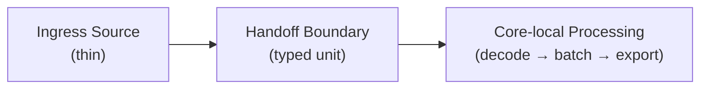
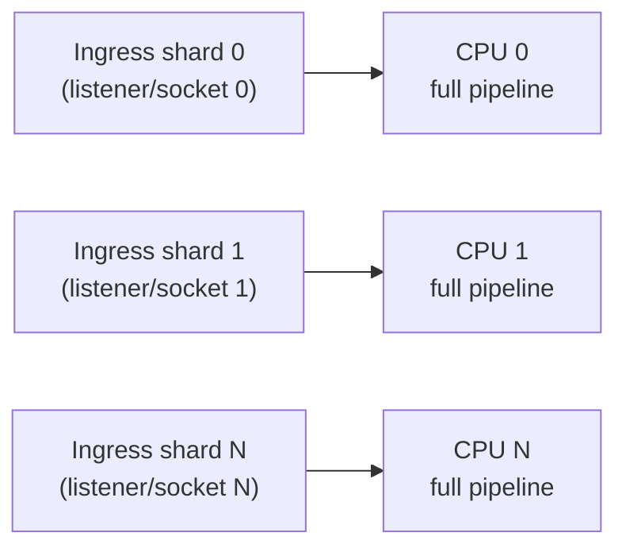
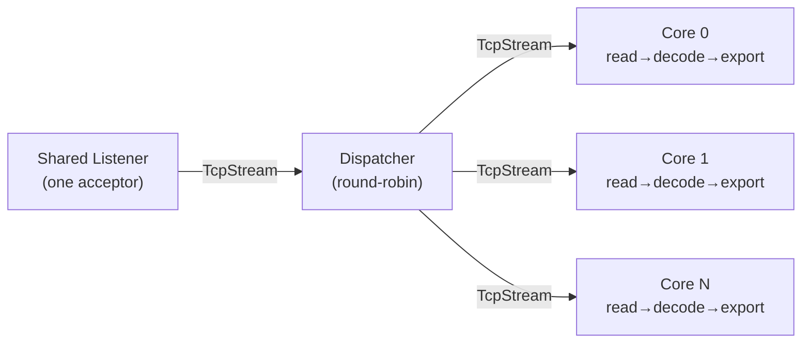
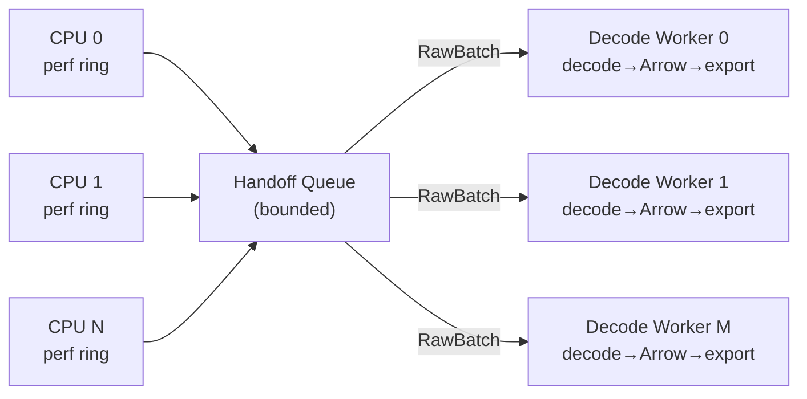
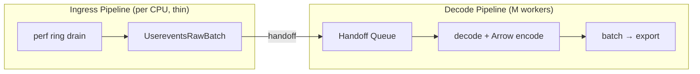

# Unified Ingress Sharding Strategies for Shared-Nothing Pipelines

## Related

- `#2364` Windows Networking: multi-threaded consumer support
- `#2186` macOS `SO_REUSEPORT` does not load-balance across listeners

## Summary

Different ingress sources and platforms need different mechanisms to preserve
shared-nothing, core-local processing. The engine should unify the abstraction
for ingress sharding while allowing different concrete mechanisms per source.

Core principle: unify the abstraction, not the mechanism.

## Problem

Some ingress sources cannot rely on kernel-native per-core sharding.

Examples:

- Linux TCP/UDP can use `SO_REUSEPORT`
- Windows/macOS TCP cannot rely on equivalent kernel listener sharding
- Linux `user_events` uses per-CPU perf rings, which preserve ingest locality
  but can create downstream CPU skew
- Some future UDP or non-socket sources may also need explicit redistribution

These cases are related, but they do not share one universal runtime
primitive.

## Background

For Linux `user_events`, there is prior art in existing single-threaded C++
implementations that use one all-CPU reader with inline decode. That validates
consolidated ring reading as a workable ingestion model, but it does not
address the scaling needs of a high-throughput export pipeline where decode and
downstream work are materially more expensive than ring draining.

In the OTAP Dataflow engine, each worker thread runs a single-threaded async
pipeline pinned to one CPU core. For network receivers, the engine uses
`SO_REUSEPORT` on Linux so the kernel distributes incoming connections or
datagrams across per-core listeners with no user-space coordination. This is
the `kernel_sharded` baseline: each core owns its full ingress-to-export
lifecycle independently.

The problem arises when a source does not have a `SO_REUSEPORT` equivalent. On
Windows and macOS, `SO_REUSEPORT` either does not exist or does not
load-balance. For Linux `user_events`, perf ring buffers are per-CPU kernel
structures and there is no mechanism for the kernel to redistribute events
across cores. Both cases break the shared-nothing property and require an
explicit user-space handoff strategy.

## Goals

- Keep ingress thin before any cross-core handoff
- Preserve core-local processing after the handoff boundary
- Use the earliest safe handoff unit for each source
- Make backpressure and drop semantics explicit
- Expose enough metadata for the engine controller to select and wire the
  correct strategy at pipeline startup
- Allow incremental implementation per source/platform

## Non-Goals

- Do not require all ingress strategies to use topics
- Do not require all handoff units to fit inside `OtapPayload`
- Do not solve every UDP/platform combination in v1
- Do not finalize a universal plugin/extensibility model for future handoff
  types in v1

## Common Model

All strategies fit the same shape:

`ingress -> handoff/rebalance boundary -> core-local processing`



The engine supports multiple ingress sharding strategies:

- `kernel_sharded`
  Kernel distributes ingress directly across per-core listeners/workers
- `socket_handoff`
  A shared listener accepts connections and transfers ownership once to a
  core-local worker
- `raw_batch_handoff`
  Ingress reads/drains source data and hands off typed raw batches before
  expensive decode/transform work

`raw_batch_handoff` is the precise term for the `user_events` case. If later
needed, it can sit under a broader umbrella concept such as `data_handoff`.

## Topology Shapes

The controller/runtime must support multiple topologies:

- `kernel_sharded`: `N -> N`
  Example: Linux sockets with `SO_REUSEPORT`
- `socket_handoff`: `1 -> N`
  Example: Windows/macOS TCP shared listener handing accepted sockets to
  per-core runtimes
- `raw_batch_handoff`: `N -> M`
  Example: Linux `user_events`, where `N` per-CPU readers feed `M` decode
  workers

Different strategies use different topologies. Some start with one ingress
source, some start with many, and the number of processing workers does not
always match the number of ingress shards.

`kernel_sharded` (`N -> N`):



`socket_handoff` (`1 -> N`):



`raw_batch_handoff` (`N -> M`):



## Locality Tradeoff

`raw_batch_handoff` preserves core-locality only up to the handoff boundary.

For Linux `user_events`, the per-CPU ingress worker still owns:

- perf session setup
- perf ring draining
- raw batch construction

After handoff, however, decode and downstream processing may run on any decode
worker selected by the handoff mechanism. This means `raw_batch_handoff` does
not preserve strict end-to-end core affinity from a CPU-specific ring buffer to
a fixed CPU-specific pipeline.

This is an intentional tradeoff. The current per-CPU design maximizes locality
but preserves CPU skew. `raw_batch_handoff` relaxes end-to-end core affinity in
order to absorb skew before the expensive decode and export stages.

`socket_handoff` has a similar characteristic: a one-time cross-core transfer
at connection accept time. After handoff, the connection's full lifecycle is
core-local, so the locality cost is bounded to connection establishment.

Future refinements may reduce this tradeoff, for example:

- NUMA-local handoff groups
- sticky handoff by source CPU
- bounded worker subsets per ingress shard

These are optimizations, not requirements for v1.

## Strategy Matrix

<!-- markdownlint-disable MD013 -->
| Source | Strategy | Handoff unit | Core-local phase |
| --- | --- | --- | --- |
| Linux TCP/UDP | `kernel_sharded` | kernel distribution | full socket lifecycle |
| Windows/macOS TCP | `socket_handoff` | accepted socket | connection lifecycle after handoff |
| Linux `user_events` | `raw_batch_handoff` | `RawUsereventsRecord` batch | decode -> Arrow -> process -> export |
| UDP on non-Linux platforms | deferred | — | — |
<!-- markdownlint-enable MD013 -->

macOS is included here because although it exposes `SO_REUSEPORT`
syntactically, it does not distribute connections across listeners in the way
Linux does. In practice, traffic is delivered to one socket, so macOS belongs
under `socket_handoff`, not `kernel_sharded`.

## Placement in Engine

The strategy declaration must live in a place the controller can inspect during
wiring.

Two likely options:

- extend `ReceiverFactory`
- extend or complement `WiringContract`

`ReceiverFactory` is likely the more natural home, since sharding strategy is a
property of the source implementation rather than a topological wiring rule.
This will be confirmed as the first design decision in the engine placement
sub-task of v1.

Even if strategy metadata is surfaced through receiver registration, strategy
resolution may still be platform-dependent. For example, a network receiver may
use `kernel_sharded` on Linux and `socket_handoff` on macOS or Windows. The
controller therefore needs enough information to resolve strategy at pipeline
startup rather than assuming one fixed runtime mode across all platforms.

Illustrative shape only:

```rust
/// Current ReceiverFactory (illustrative, simplified).
/// The new `ingress_sharding` field is the only addition.
pub struct ReceiverFactory<P> {
    pub name: &'static str,
    pub create: fn(...) -> Result<ReceiverWrapper<P>, ...>,
    pub wiring_contract: WiringContract,
    pub validate_config: fn(...) -> Result<(), ...>,
    /// NEW: declares how this receiver participates in ingress sharding.
    /// The controller reads this at pipeline-wiring time to select the
    /// appropriate handoff mechanism.
    pub ingress_sharding: IngressShardingStrategy,
}

enum IngressShardingStrategy {
    KernelSharded,
    SocketHandoff,
    RawBatchHandoff,
}

pub static USEREVENTS_RECEIVER: ReceiverFactory<OtapPdata> = ReceiverFactory {
    name: USEREVENTS_RECEIVER_URN,
    create: |...| { ... },
    wiring_contract: WiringContract::UNRESTRICTED,
    validate_config: ...,
    ingress_sharding: IngressShardingStrategy::RawBatchHandoff,
};
```

This enum is conceptual. Exact placement in engine types is an explicit design
item for v1.

The engine/controller abstraction should stop at generic sharding strategy,
topology, and handoff semantics. Receiver-specific handoff payloads remain
owned by the receiver implementation and should not be elevated into
engine-level or controller-level enums unless later experience shows that a
generic strategy model is insufficient.

## Handoff Units

The engine should transfer the earliest safe ownership unit for each strategy.

- `socket_handoff`
  Transfers connection ownership, not decoded telemetry
- `raw_batch_handoff`
  Transfers typed raw batches before expensive decode work

For `user_events`, the handoff unit should reuse the existing raw record shape
rather than inventing an untyped blob. The existing `RawUsereventsRecord` in
`crates/core-nodes/src/receivers/userevents_receiver/session.rs` already
carries the needed decode fields. The batch handoff should therefore be a
receiver-local batch wrapper around those records, or a zero-copy equivalent,
with any required batch-level metadata.

Illustrative receiver-local handoff payload:

```rust
/// Batch of raw perf samples for cross-core handoff.
/// Wraps the existing RawUsereventsRecord without re-encoding.
/// The ingress worker fills this; the decode worker consumes it.
pub struct UsereventsRawBatch {
    /// Records drained from one CPU's perf ring in a single turn.
    pub records: Vec<RawUsereventsRecord>,
    /// Sum of payload bytes across all records.
    /// Used for byte-aware queue accounting if the handoff queue supports it.
    pub total_payload_bytes: usize,
}
```

Do not use:

- `OtlpBytes` as a raw transport
- generic `Opaque(Bytes)` for the `user_events` handoff path in v1

## Why Topics Are Not the Universal Primitive

Topics are not the correct primitive for `socket_handoff`, because the handoff
unit is connection ownership rather than telemetry data.

For `raw_batch_handoff`, however, the existing balanced topic mechanism is a
reasonable interim implementation, and may remain acceptable long-term when
used at batch granularity.

So the architectural requirement is not “all handoffs use topics.” It is: the
engine must support the appropriate bounded handoff primitive per strategy.

In practice:

- topics are acceptable for some batch-level data redistribution cases
- topics should not define the long-term architecture for every ingress
  strategy

If balanced topic is used as an interim `raw_batch_handoff` mechanism, note
that current buffering is message-count-based rather than byte-aware. For
variable-sized raw batches, queue sizing may need byte-aware accounting to
avoid underestimating memory pressure.

## Runtime Primitive Guidance

- `socket_handoff`
  Should use an engine-internal handoff primitive, not topic transport
- `raw_batch_handoff`
  May use:
  - a dedicated internal handoff primitive
  - or the existing balanced topic as an interim implementation

The exact queue mechanism is intentionally left open at the RFC level, but it
must support the topology and semantics of the relevant strategy.

## Backpressure and Loss Semantics

Different strategies fail differently and must expose distinct telemetry.

- `kernel_sharded`
  Existing per-core pipeline/channel behavior applies
- `socket_handoff`
  Full handoff queues stall the acceptor and push pressure back toward OS
  socket backlog
- `raw_batch_handoff`
  Full handoff queues cause drop, because perf ring producers in the Linux
  kernel cannot be paused or slowed by the reader

Metrics should distinguish:

- source-level loss
- handoff-queue drops
- downstream saturation
- decode/transform failures

## Failure, Recovery, and Shutdown

These strategies should fit within the engine's existing task lifecycle and
control-channel model rather than introducing a separate failure domain.

- If an ingress task or decode worker fails, the runtime should report failure
  using the existing engine supervision path and fail the affected pipeline in
  the same way as other receivers/processors.
- `raw_batch_handoff` should treat in-flight handoff batches as transient
  pipeline state. A worker failure may lose in-flight batches unless a future
  durability mechanism is introduced.
- `socket_handoff` should stop accepting new connections during shutdown and
  let in-flight handoff channels and per-core workers drain according to normal
  pipeline shutdown behavior.
- `raw_batch_handoff` should stop admitting new batches during shutdown and
  flush or drop any remaining handoff-queue contents according to the configured
  shutdown/drain policy.

## V1 Concrete Scope

1. Define the ingress sharding model and engine placement
2. Implement `raw_batch_handoff` for Linux `user_events`
3. Implement `socket_handoff` for Windows/macOS TCP
4. Defer UDP on non-Linux platforms
5. Keep initial controller/config behavior conservative rather than promising
   full platform transparency

Illustrative configuration shape:

```yaml
receivers:
  userevents:
    ingress_sharding:
      strategy: raw_batch_handoff
      decode_workers: 4
      handoff_queue_depth: 1024

  otlp_grpc:
    ingress_sharding:
      strategy: auto
```

This is illustrative only. The final config surface may be explicit,
platform-resolved, controller-derived, or a mix of those approaches.

## V1 Deliverable A: Linux `user_events`

- ingress remains per-CPU and thin
- ingress still owns session lifecycle and late tracepoint registration
- handoff unit is a typed batch of existing `RawUsereventsRecord`
- decode and Arrow encoding move after the handoff boundary
- worker count `M` must be configurable or controller-derived

**Prerequisite:** queue topology for `N -> M` handoff must be decided before
implementation begins, since it determines whether ingress workers target a
shared queue, a dispatcher, or per-worker channels.

This preserves the existing ownership model for session setup and retry
behavior while moving the skewed CPU work later in the pipeline.



## V1 Deliverable B: Windows/macOS TCP

- one shared listener
- accepted sockets handed off once to per-core runtimes
- post-handoff lifecycle remains core-local

Illustrative shape:

```rust
// Engine startup: one bounded channel per core worker.
let (channels, receivers): (
    Vec<Sender<TcpStream>>,
    Vec<Receiver<TcpStream>>,
) = cores
    .iter()
    .map(|_| tokio::sync::mpsc::channel::<TcpStream>(256))
    .unzip();

// `receivers` are passed to their respective per-core runtimes.

// Single acceptor task.
tokio::spawn(async move {
    let listener = TcpListener::bind(addr).await?;
    let mut next = 0;
loop {
        let (stream, _) = listener.accept().await?;
        // One-time ownership transfer; core takes over from here.
        // A full handoff queue should apply backpressure to the acceptor
        // rather than silently dropping accepted connections.
        channels[next].send(stream).await?;
        next = (next + 1) % channels.len();
    }
});

// Per-core worker: receives and owns the connection fully.
while let Some(stream) = rx.recv().await {
    tokio::task::spawn_local(async move {
        handle_connection(stream).await; // read -> decode -> process -> export
    });
}
```

## Open Questions

- Where exactly does `IngressShardingStrategy` live in engine metadata:
  `ReceiverFactory`, `WiringContract`, or both?
- What is the concrete internal primitive for `socket_handoff`?
  Candidate directions:
  - per-core `tokio::sync::mpsc::channel<TcpStream>` created at engine startup
  - engine-owned acceptor task dispatching to bounded per-core queues
  - a dedicated engine/effect-handler primitive wrapping the same model
- What queue topology should `raw_batch_handoff` use for `N -> M` cases?
  - shared queue
  - dispatcher plus per-worker queues
  - existing balanced topic as interim
- How is decode worker count `M` configured or derived for
  `raw_batch_handoff`?
- Should receiver-specific handoff payloads remain receiver-owned, with the
  engine only modeling generic sharding strategies, or is a broader engine
  registration model needed later?
- How much platform transparency should the controller provide in v1 versus
  later?

## Recommended Position

File this as an umbrella RFC.

Then track at least two concrete sub-issues:

- `user_events` via `raw_batch_handoff`
- Windows/macOS TCP via `socket_handoff`

That keeps the common architecture coherent while allowing the two
implementations to proceed independently once the engine placement for strategy
metadata is decided.
