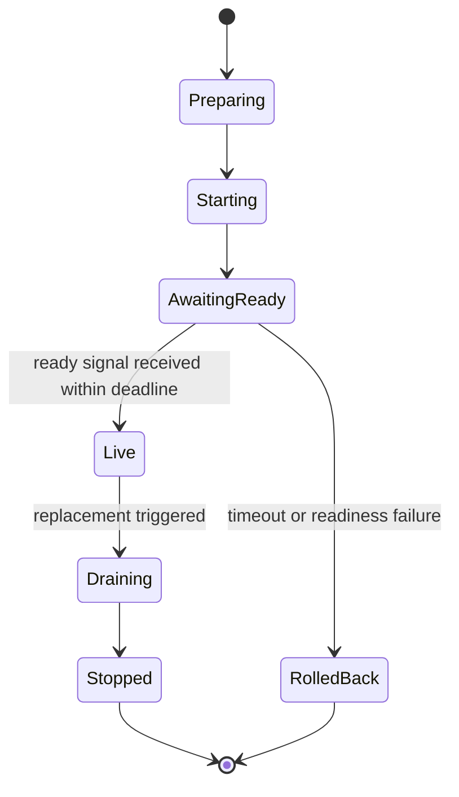
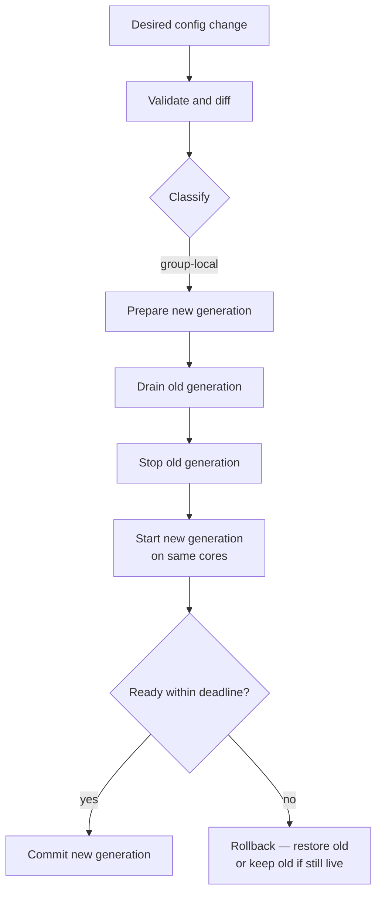
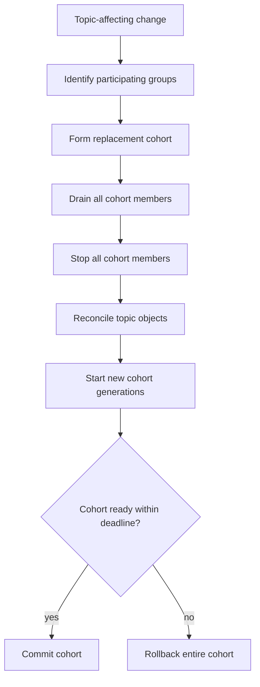

# RFC: Pipeline-Group Live Reconfiguration

**Status:** Draft
**Last updated:** 2026-03-27

---

## Summary

This RFC defines how the OTAP Dataflow engine supports live configuration
changes without restarting the process.

The core model is **generation-based group replacement**: when configuration
changes, the affected pipeline group is rebuilt as a new generation and cut
over, while unrelated groups keep running. In-place graph mutation is
explicitly out of scope.

---

## Motivation

The current controller is a one-shot bootstrapper. Once a pipeline group is
running, the only way to apply a configuration change is a full process
restart. This is operationally expensive and makes config-driven workflows
(sampling rates, routing rules, endpoint changes) unnecessarily disruptive.

The goal is to let a control plane apply changes with bounded blast radius:
changes to one group should not interrupt unrelated groups, and the rollout
model should be simple enough to reason about during an incident.

---

## Goals

- Apply configuration changes to one pipeline group without disturbing others.
- Preserve the thread-per-core, share-nothing execution model.
- Make rollouts observable, reversible, and bounded in scope.
- Keep the rollout model simple enough for operators to reason about under
  pressure.

## Non-Goals

- In-place mutation of the running DAG.
- Hot-swap of channel wiring or node topology.
- Making every node dynamically reconfigurable.
- Zero-downtime updates across a fleet from within a single process.

---

## Background: Why the Runtime Graph Is Immutable

The engine imposes structural constraints that make in-place graph surgery
unsafe, not merely inconvenient:

- **Build-time channel endpoints.** Node instances receive sender/receiver
  handles at construction time. There is no indirection layer to swap.
- **Build-time topic bindings.** `TopicBroker` and all topic subscriptions are
  fully materialized before any pipeline starts. Stale handles cannot be
  transparently replaced.
- **`!Send` nodes on `LocalSet`.** Each pipeline thread runs a
  `tokio::runtime::Builder::new_current_thread()` with a `LocalSet`. Nodes
  can be `!Send`. Mutating the task graph across thread or ownership boundaries
  is unsound in the Rust type system, not just architecturally undesirable.
- **Explicit design principle.** The engine is documented as "config is fixed
  at startup; control messages are for operational actions."

**Consequence:** live update works by building a new runtime generation, not
by mutating the existing one.

---

## Design

### Update Classification

Every configuration change must be classified before rollout:

| Change type | Mechanism |
|---|---|
| Node-local runtime-safe parameter (e.g. retry limit, sampling rate) | Hot patch — Phase 2 only |
| Group-local topology, node set, ports, wiring | Replace group |
| Shared-topic contract or binding | Replace cohort |
| Engine-global service or bootstrap assumption | Restart process |

Classification is the controller's responsibility. Node types declare their
capability. The controller does not infer dynamic safety from implementation
detail.

### Node Capability Declaration

Each node type declares one of:

- `static_only` — no runtime update supported
- `hot_patchable` — specific fields may be updated via control message; the
  node must enumerate those fields explicitly
- `replace_required` — any change requires group replacement

Hot patching is an **exception path**, not a feature tier. It requires
explicit opt-in at the node level, explicit field enumeration, and explicit
validation. It belongs in Phase 2.

### Controller Model

The controller evolves from a startup orchestrator into a **persistent
reconciler**.

```
┌─────────────────────────────────────────────────────────┐
│                     Control Plane                       │
│                                                         │
│   Desired Spec ──► Controller Reconciler ──► Rollout    │
│                          │                    Status    │
│                    Deployment Registry                  │
│                    Topic/Cohort Model                   │
│                    Per-Generation State                 │
└─────────────────────────────────────────────────────────┘
```

The controller owns:

- desired configuration
- current deployed generations (group → generation → state)
- group-to-topic dependency model (used for cohort detection)
- rollout state machine per generation
- readiness deadlines
- rollback decisions

### Group Generation State Machine

The controller tracks a lifecycle state for each deployed group generation.
This state machine is required for rollout gating and rollback; pipeline
health signals alone are insufficient.



Every generation must pass through `AwaitingReady` before it can be committed.
A generation that times out in `AwaitingReady` is rolled back automatically.

### Readiness Contract

A generation is **ready** when all of the following are true:

1. Configuration has been admitted without error.
2. All required listeners are bound.
3. All required topic subscriptions and publishers are established.
4. The pipeline runtime reports ready before the rollout timeout.
5. The controller observes the generation transition to `Live`.

Readiness is a deployment-side contract, not a health endpoint. The controller
must record rollout start time, deadline, and outcome for each generation.

---

## Rollout Algorithms

### A. Single-Group Replacement

Use when the change is local to one group and does not affect any shared-topic
contract.



Key properties:

- Non-overlapping by default. Old generation stops before new starts.
- Same cores. New generation binds to the same cores the old generation held.
- Core oversubscription is not used in Phase 1.

### B. Shared-Topic Cohort Replacement

Use when the change affects a topic contract shared by multiple groups. Those
groups are not operationally independent and must be replaced together.

**Cohort rule:** if a topic is used only inside one group, that group can be
replaced independently. If a topic is shared across groups, those groups form
a replacement cohort. Any change to the shared topic contract requires
replacing the entire cohort.



Phase 1 explicitly avoids:

- live topic ownership handoff
- dual-published topic generations
- reference-counted topic cutover
- mixed old/new subscriber semantics

These are possible Phase 3 directions. They add significant complexity for
limited gain in the common case.

---

## Message-Loss Policy

This is an explicit policy decision, not an implementation detail.

Under the Phase 1 model:

- Ingress is drained before the old generation stops, where possible.
- Messages buffered inside internal topic queues at shutdown time are **not
  guaranteed to survive replacement**.

This is acceptable for a telemetry pipeline where some loss during
reconfiguration is operationally tolerable. It must be documented as policy
rather than left as accidental behavior.

**Open question for Phase 1B:** does cohort replacement need stronger delivery
guarantees for messages in flight on cross-group topics at the time of
replacement? If yes, a topic-drain step between stop and topic reconciliation
is required.

---

## Observability

Rollout status must be first-class, not inferred from logs.

The following must be observable per group generation:

- `desired_generation` — what the controller wants
- `current_generation` — what is currently `Live`
- `rollout_phase` — one of the state machine states
- `old_generation_state` and `new_generation_state` independently
- `rollout_start_time`, `readiness_deadline`, `rollout_outcome`
- `rollback_reason` when a rollback occurs

---

## Rollback

Rollback is automatic when:

- The new generation fails admission.
- The new generation fails readiness within deadline.
- Shared-resource reconciliation fails.
- (Future) Post-cutover health degrades beyond policy threshold.

Rollback means: keep or restore the old generation as authoritative, tear down
the failed new generation, and emit a rollout failure event with the blocked
phase and reason.

---

## API Shape

The control API should be intention-based, not a low-level runtime mutation
surface:

```
ApplySpec(desired_spec) -> RolloutHandle
PreviewDiff(desired_spec) -> ChangeSet
ReplaceGroup(group_id, group_spec) -> RolloutHandle
PatchNodeConfig(group_id, node_id, patch) -> PatchHandle   // Phase 2
GetRolloutStatus(handle) -> RolloutStatus
AbortRollout(handle)
```

Do not expose primitives that allow callers to drive individual rollout phases.
That leaks implementation detail and makes future changes harder.

---

## Phase Plan

### Phase 1A — Single-group replacement

- Persistent reconciler replacing the one-shot bootstrapper
- Generation registry per group
- Controller rollout state machine
- Non-overlapping replace-group rollout
- Readiness timeout and rollback

### Phase 1B — Shared-topic cohort replacement

- Group-to-topic dependency model
- Cohort detection
- Cohort rollout and topic reconciliation
- Explicit message-loss policy

### Phase 2 — Limited hot patch

- Node capability declaration (`static_only` / `hot_patchable` / `replace_required`)
- Controller routing for runtime-safe mutable fields
- Audit trail and per-field rollback expectations

### Phase 3 — Advanced optimizations

- Overlapping rollout using spare cores
- Richer cohort cutover strategies
- Topic generation indirection if lossless reconfiguration becomes a hard requirement

---

## Alternatives Considered

**In-place graph mutation.** Rejected. The combination of build-time channel
handle baking, build-time topic materialization, `!Send` nodes, and per-thread
`LocalSet` runtimes makes this unsafe at the Rust type level, not just
operationally undesirable.

**Hot patch as the primary mechanism.** Rejected. Config immutability is a
stated engine design principle. Making it the primary path would require
retrofitting mutability into the node model broadly, breaking the existing
invariant. Hot patch as a narrow escape hatch for a small set of explicitly
safe fields is the right scope.

**Full topic live-handoff.** Rejected for Phase 1. Reference-counted topic
cutover or dual-published generations add protocol complexity disproportionate
to the Phase 1 requirement. The cohort model achieves the same operational
goal more conservatively.

**Overlapping generations as the default.** Rejected for Phase 1. Core
oversubscription during overlap conflicts with the deterministic
thread-per-core performance model. Overlap is a future optimization gated on
spare-core availability.

---

## Open Questions

1. **Message-loss SLA during cohort replacement.** Is best-effort drain
   sufficient, or is a hard topic-drain-before-stop step required in Phase 1B?

2. **Cohort boundary for large shared topics.** If a single topic is shared
   by many groups, cohort replacement could be expensive. Should there be a
   policy for maximum cohort size before falling back to process restart?

3. **Readiness timeout configurability.** Should the rollout timeout be
   per-group, per-pipeline, or a global engine setting?

4. **Control plane integration.** Phase 3 mentions OpAMP or similar. Should
   the API shape be constrained now to make that integration easier later?
