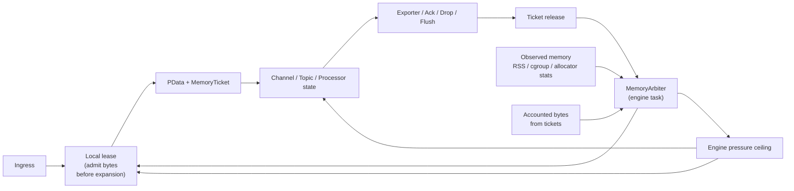

# Memory Limiter Design for the Rust OTAP Collector

## Summary

The memory limiter should not be a single periodic "check RSS and reject"
feature. That is too slow, too coarse, and too reactive for OTAP workloads.

The proposed design is a **hierarchical, lease-based memory budget** with a
**feedback controller**:

- **Hot path**: exact-or-estimated byte accounting for memory we create or
  queue.
- **Cold path**: periodic RSS / cgroup reconciliation for memory we do not
  directly account.
- **Control path**: progressive reclaim and backpressure actions before the
  process reaches OOM territory.

This keeps the existing thread-per-core model intact, preserves bounded queues
and explicit backpressure, and fits the current architecture better than a
standalone "memory_limiter processor" copied from the Go collector.

The limiter should be hierarchical in both **budgeting** and **control**:

- the engine owns a global ceiling
- each pipeline owns its own pressure state derived from its budget share
- global pressure acts as an override ceiling, not the default throttle for all
  pipelines



## Why the collector needs a different design

The current OTAP collector already has pieces that matter:

- receiver-side admission and `poll_ready` backpressure
- bounded pdata channels
- topic-level bounded publish tracking
- durable buffering with a watermark-style `DiskBudget`
- engine-wide RSS metrics

The missing piece is that these mechanisms do not share a common **RAM budget**.
Each one protects one queue or subsystem, but nothing protects total process
memory as a first-class resource.

For OTAP specifically, the risk is not only queued request bodies. Memory also
comes from:

- queued pdata in channels and topics
- in-flight exporter payloads
- batch processor accumulation
- retry backlogs
- Arrow dictionaries and stream-local state
- transient decode / transform expansions
- allocator fragmentation and other untracked process memory

If we only sample RSS every few seconds, we detect overload late. If we only
count requests, we misprice different payload sizes. The limiter therefore has
to combine **accounting** and **measurement**.

## Design goals

- Prevent OOM and severe swap / reclaim thrash.
- Apply backpressure early, preferably before large bodies are fully accepted.
- Preserve thread-per-core and share-nothing hot paths.
- Keep overhead low enough for high-throughput ingest.
- Work for OTLP and OTAP, not only one receiver.
- Support progressive degradation before hard refusal.
- Expose stable telemetry for tuning and incident response.

## Expected overhead

The memory limiter is not free. Its overhead comes from two places:

- **hot path**: lease checks, ticket creation / transfer, and any retained
  metadata attached to in-flight pdata
- **cold path**: the arbiter's periodic observed-memory sampling,
  reconciliation, and pressure-state evaluation

The design keeps this overhead bounded by using per-core local leases instead
of global coordination on every message, and by keeping observed-memory
reconciliation in one controller-owned background task.

Operationally:

- `disabled` should keep hot-path overhead near zero
- `observe_only` adds measurement and simulated decisions without enforcement
- `enforce` adds the full admission, pressure, and reclaim behavior

## Non-goals

- Perfect byte accounting of every allocator call.
- Dynamic work stealing or hidden cross-core scheduling.
- A first release that solves every processor-specific memory spike.
- Using a GC-like stop-the-world reclamation model.

## Core idea

Introduce a new engine-level facility:

- `MemoryBudget`: watermark-based global RAM budget
- `MemoryArbiter`: engine task that owns global state and feedback control
- `MemoryLease`: per-core local credit slab for cheap hot-path admission
- `MemoryTicket`: metadata attached to admitted work so bytes are released when
  the work leaves memory

The design has three layers.

### 1. Accounted memory

For memory we can estimate cheaply, we reserve bytes before accepting or
creating work:

- receiver request bodies
- queued channel messages
- topic queue occupancy
- batch processor accumulation
- retry staging / exporter in-flight payloads
- OTAP stream dictionary growth when measurable

This memory uses `MemoryTicket`s and releases bytes on Ack, drop, flush, send
completion, or queue removal.

### 2. Shadow memory

Not all memory is directly attributable:

- allocator fragmentation
- task stacks
- library internals
- TLS / HTTP2 buffers
- temporary decode expansions we do not instrument yet

The arbiter periodically samples:

- process RSS
- cgroup memory usage and limit when present
- optionally jemalloc allocated / active bytes when available

It computes:

```text
shadow_bytes = max(0, observed_memory - accounted_bytes)
```

and reduces available global credits accordingly. This means unknown memory is
not ignored; it simply consumes from a reserved shadow pool.

If `accounted_bytes > observed_memory`, that should not underflow or create
negative shadow pressure. Instead, the limiter should clamp `shadow_bytes` to
zero and emit a diagnostic such as `overaccounted_bytes` so operators can see
that conservative estimation or delayed RSS visibility is present.

### 3. Progressive control

The limiter should not jump directly from "healthy" to "reject everything".
Instead it should move through stages:

1. **Normal**: full admission, normal batching.
2. **Pressure**: shrink ingress concurrency, prefer faster flush, reduce local
   credit refill sizes.
3. **Constrained**: stop admitting new non-essential work; backpressure or 503
   at receivers; block tracked publishes that would deepen queues.
4. **Emergency**: trigger reclaim hooks, optionally shed low-priority traffic,
   and hold the process below the hard cap.

This is the "out of the box" part: the limiter acts as a **runtime governor**,
not just a boolean threshold checker.

Pressure state should be evaluated at two levels:

- **pipeline pressure state**: the normal control surface for admission,
  throttling, and reclaim within one pipeline budget
- **engine pressure state**: a global ceiling used when total process memory is
  the dominant constraint

If one pipeline exceeds its share, that pipeline should be constrained first.
If the engine enters a higher pressure state, all pipelines inherit that higher
state as a ceiling.

The controller should use explicit hysteresis:

- transitions upward are immediate
- transitions downward require a lower exit watermark than the entry watermark
- downward transitions use a cooldown / minimum dwell time

Cooldown behavior when memory fluctuates near a boundary:

- once memory drops below the exit watermark for a stage, the cooldown timer
  starts and runs to completion regardless of interim fluctuations
- the cooldown timer does **not** reset if memory briefly spikes back above the
  exit watermark during the cooldown period
- if memory exceeds the **entry** watermark of the current or a higher stage
  during cooldown, the system transitions upward immediately (upward transitions
  are never delayed) and the downward cooldown is abandoned
- a completed cooldown permits transition to the lower stage only if memory is
  still below the exit watermark at that point

This avoids the failure mode where bursty traffic repeatedly resets a cooldown
timer and keeps the system stuck in a higher pressure state indefinitely.

Example policy:

```text
enter Pressure at 90%, exit at 85%
enter Constrained at 95%, exit at 90%
enter Emergency at 98%, exit at 94% after cooldown
```

## Budget model

Use a watermark model similar to `quiver::DiskBudget`, but for RAM.

```text
hard_cap      absolute ceiling we try not to exceed
soft_cap      start of strong pressure / backpressure
reclaim_cap   start of reclaim actions
reserve       bytes kept unallocatable for safety
```

Suggested invariant:

```text
hard_cap = effective_memory_limit - emergency_reserve
soft_cap = hard_cap - spike_headroom
reclaim_cap = soft_cap - reclaim_headroom
```

Where:

- `effective_memory_limit` comes from explicit config or cgroup/container limit
- `emergency_reserve` covers allocator lag and unavoidable overshoot
- `spike_headroom` absorbs concurrent in-flight admits
- `reclaim_headroom` gives time for control actions before refusal

This mirrors the successful disk watermark pattern already used in Quiver.

## Hierarchy

The budget should be hierarchical, not flat.

### Engine budget

One engine-wide budget limits total process memory.

### Pipeline budgets

Each deployed pipeline receives a target share:

- static equal split by default
- weighted split by policy
- optional min / max bounds per pipeline

### Domain budgets

Inside each pipeline, bytes are charged to domains:

- `ingress`
- `channel`
- `topic`
- `processor_state`
- `export`
- `durable_buffer_staging`

This gives operators a reason for pressure, not just a symptom.

For the initial implementation, `shadow` should remain engine-scoped rather
than pipeline-scoped. Most shadow sources are process-wide and not credibly
attributable to a single pipeline without heuristics. Per-pipeline shadow
attribution can be considered later if the runtime gains stronger ownership
signals.

## Lease-based hot path

Global atomics on every message will not scale. The hot path should use
per-core leases.

### Mechanism

Each worker thread holds a local byte lease, for example 1 MiB to 8 MiB.

Admission path:

1. Estimate bytes for new work.
2. Spend from local lease if enough credit exists.
3. If local lease is low, refill from arbiter in one larger chunk.
4. If refill denied, apply local backpressure immediately.

The design must define an overshoot bound explicitly. A practical first-order
bound is:

```text
pipeline_overshoot <= num_cores * local_lease
```

This overshoot bound must be included in pipeline sizing and in the relation
between pipeline share, `soft_cap`, and headroom, just as `DiskBudget`
explicitly reserves write headroom.

Release path:

- returned bytes go to a local release counter
- periodic drain or threshold crossing returns them to the global budget

Release handling should have two modes:

- **normal mode**: batch returns locally to reduce cross-thread contention
- **pressure mode**: once pressure is asserted, releases bypass local
  accumulation and return to the global budget immediately

This lets the system recover quickly when work completes under pressure instead
of waiting for the next batched drain.

Pressure visibility should also be cheap and immediate:

- a shared atomic pressure flag or small state word should be readable at
  admission and retention points
- pressure checks must not depend only on lease refill, because that delays
  reaction on busy threads

This keeps normal operation lock-free on the hot path and makes pressure
propagation coarse enough to be cheap but fine enough to remain accurate.

## Memory ticket lifecycle

Every admitted unit of work gets a `MemoryTicket`.

A ticket contains at least:

- reserved bytes
- memory domain
- pipeline id
- optional signal class / priority

Possible lifecycle:

```text
receiver admit
  -> attach ticket to pdata envelope
  -> queue / route / process
  -> split or clone adjusts ticket ownership
  -> final Ack / drop / spill / export completion releases bytes
```

The in-flight carrier should be explicit. The simplest default is:

- an optional `MemoryTicket` field on the pdata envelope or its immediate
  wrapper

That keeps ownership local to the data plane, allows the limiter to be disabled
with `None`, and avoids side metadata maps on the hot path.

Important rule:

- bytes should be owned by the runtime object currently responsible for holding
  the data in memory

That means queue boundaries must transfer ticket ownership cleanly.

### Accounting rule for clones, fanout, and retention

The core rule is:

- **charge when memory occupancy increases**

This is the principle. Queue send and topic publish are common trigger points,
but they are not the rule by themselves.

Concrete implications:

- channel enqueue charges when the queue now retains bytes
- topic publish charges when topic state now retains bytes
- batch accumulation charges when the batch now holds additional payload bytes
- retry retention charges when backlog state now owns bytes
- explicit deep copy charges when a processor materially duplicates payload data
- cheap `Arc` clone without new retained bytes does **not** charge by itself

Example — fanout through a topic with two subscribers:

- a message with a 10 KiB payload is published to a topic with two balanced
  consumer-group subscribers
- the topic publishes `Arc<Payload>` to each subscriber queue; both references
  point to the same underlying allocation
- the ticket charges 10 KiB once, when the topic retains the payload
- when subscriber A dequeues and processes its clone, it does not release the
  ticket because the payload is still retained by subscriber B's queue
- the ticket releases its bytes only when the last retaining queue removes the
  message (the last `Arc` clone drops, or the last subscriber Acks)
- if a processor in one subscriber's path deep-copies the payload to mutate it,
  that copy creates a new allocation and must acquire a new ticket for the
  copied bytes

This avoids transport-specific accounting and matches the actual memory model of
the runtime.

### Lifetime rule

`MemoryTicket` must be RAII-managed:

- releasing bytes in `Drop` is the default behavior
- release must not depend on async cleanup
- release must not require runtime-local context that may already be gone

Explicit handoff between holders is still allowed, but orphaned tickets must
fail safe by returning bytes on drop.

Because work may cross thread boundaries, ticket release must be cross-thread
safe:

- `MemoryTicket` should release through a shared `Arc`-backed budget path
- `Drop` must not assume it runs on the same pipeline thread that acquired the
  lease
- local lease batching is a fast-path optimization, not the only valid release
  path

Phase 2 implementers should keep the concrete carrier shape in mind here: if a
ticket follows `Arc`-retained payload through fanout, the ticket itself will
also need shared ownership or equivalent last-retainer semantics so bytes are
released exactly once.

## Admission points

The first implementation should hook the places that already shape pressure.

### Receivers

Receivers are the first line of defense and should consult the limiter before
accepting more work.

- OTLP gRPC: gate in `poll_ready`, using estimated request bytes where possible
- OTLP HTTP: gate before or while collecting body; reject before expensive work
- OTAP gRPC: gate before accepting larger stream batches or allocating response
  state

This extends the existing shared semaphore idea from "request count" to
"request bytes".

### Queues and topics

Bounded queue length is not enough; ten tiny batches and ten huge batches do
not cost the same.

Queue publish should charge:

- payload bytes
- envelope overhead
- topic / channel metadata overhead

For topics, tracked publish should fail or wait when byte budget is exhausted
even if item count capacity remains.

### Stateful processors

Processors that intentionally retain data need explicit hooks:

- batch processor: reserve on accumulate, release on flush
- retry processor: reserve while backlog is retained
- durable buffer processor: charge only in-memory staging, not persisted bytes
- OTAP receiver/exporter stream state: charge dictionary / compression state

## Stream-state governor for OTAP

A plain memory limiter usually ignores protocol state. OTAP should not.

Add a small protocol-specific governor:

- each OTAP stream tracks estimated dictionary + schema state bytes
- stream state is charged to `processor_state` or `ingress`
- under pressure, the arbiter may request **stream recycling**

This is useful because OTAP memory can grow even when queue depths look stable.

Pressure action:

- gracefully rotate the heaviest streams first
- bound recycle rate so we do not create a reconnection storm
- default to serialized recycling with concurrency 1 while under pressure
- wait for prior stream-state accounted bytes to drop, or for a bounded timeout,
  before rotating the next stream when in constrained or emergency states

This is one of the highest-leverage OTAP-specific features.

## Pressure actions

Actions should be ordered from least disruptive to most disruptive.

### Stage A: soft pressure

- reduce refill chunk sizes
- shrink receiver concurrency limits
- flush batch processors earlier
- reduce exporter in-flight parallelism
- ask OTAP streams to recycle if they exceed state targets

### Stage B: hard pressure

- stop new tracked topic publishes unless downstream frees memory
- backpressure receivers at `poll_ready`
- make HTTP receivers return 503 earlier instead of buffering

### Stage C: emergency

- run registered reclaim hooks immediately
- optionally shed low-priority traffic if configured
- emit prominent internal events and admin state

The collector should prefer **backpressure first**, then **lossy policies only
when explicitly configured**.

Receiver overload behavior should follow the protocol's native failure model:

- request / response protocols should reject explicitly with protocol-native
  overload signals such as HTTP 503 or gRPC `resource_exhausted`
- streaming protocols with application-level batch or status responses should
  prefer explicit per-batch refusal over indefinite transport stalling
- raw TCP push protocols without refusal semantics should close connections
  under sustained pressure rather than holding large numbers of stalled sockets
- UDP or other datagram protocols should drop input under pressure; graceful
  flush is appropriate for shutdown / drain, not overload handling

## Reclaim hooks

The arbiter should support subsystem-specific reclaim hooks. Examples:

- batch processor: force flush
- retry processor: pause intake, continue drain
- topic runtime: stop queue growth
- OTAP protocol: recycle selected streams
- telemetry internals: drop non-essential internal telemetry under pressure

Hooks must be:

- idempotent
- non-blocking to trigger
- best-effort

The arbiter issues hooks asynchronously and then rechecks observed memory on
the next sample.

## Configuration model

Add a new policy block:

```yaml
policies:
  memory:
    mode: enforce
    limit: 8 GiB
    soft_limit_percent: 90
    reclaim_limit_percent: 85
    spike_headroom: 512 MiB
    emergency_reserve: 256 MiB
    local_lease: 4 MiB
    shadow_reserve_percent: 15
    action_on_hard_limit: backpressure
    priority_classes:
      default:
        weight: 100
      internal_telemetry:
        weight: 10
        shed_on_emergency: true
```

Policy scope should match existing inheritance:

- engine-level default
- pipeline-group override
- pipeline override

Suggested first-release fields:

- `mode` (`disabled`, `observe_only`, `enforce`)
- `limit`
- `soft_limit_percent`
- `spike_headroom`
- `emergency_reserve`
- `local_lease`
- `action_on_hard_limit`

Later fields:

- pipeline weights
- priority classes
- OTAP stream-state caps
- reclaim action toggles

### Phase 1 implementation note

The current Phase 1 implementation is intentionally narrower than the full
configuration model above.

It currently uses a process-wide `resources.memory_limiter` policy with fields
such as:

- `source`
- `check_interval`
- `soft_limit`
- `hard_limit`
- `hysteresis`
- `retry_after_secs`
- `fail_readiness_on_hard`

Important limitations of that first implementation:

- there is not yet a separate `observe_only` mode; if configured, the limiter
  enforces admission decisions
- `Soft` pressure is advisory only and does not yet trigger the fuller Stage A
  control actions described above
- cooldown timers are not yet implemented; the simpler implementation relies on
  threshold hysteresis only
- `auto` currently means cgroup-derived limits when available; host-memory
  fallback is a later enhancement, not part of the first implementation

## Sizing source of truth

The limiter should determine the effective limit in this order:

1. explicit configured limit
2. cgroup memory limit if running in a container
3. host memory based fallback

If cgroup limit is effectively unlimited, treat it as unset.

The host fallback should be conservative, not full host RAM. A practical first
default is:

- use a platform-appropriate observed available-memory signal at startup
- default the effective limit to a conservative fraction of that signal, for
  example 80%

This should be documented as a fallback heuristic, not a precise isolation
boundary on shared hosts.

The limiter should export both:

- configured limit
- detected effective limit

so operators can see what actually applies.

## Estimation strategy

Exact byte accounting everywhere is unnecessary. The estimator only needs to be
stable and conservative.

### Suggested initial estimators

- OTLP bytes payload: body length + fixed envelope cost
- OTAP payload: encoded bytes + stream metadata estimate
- channel/topic queued item: payload estimate + queue node overhead
- batch processor accumulation: sum of member ticket bytes + batch struct cost

Conservative bias is acceptable. Underestimating is worse than modest
overestimation.

## Telemetry

The limiter must be observable or it will be impossible to tune.

Recommended engine metrics for the full accounting-based design:

- `engine.memory.limit`
- `engine.memory.soft_limit`
- `engine.memory.accounted`
- `engine.memory.shadow`
- `engine.memory.overaccounted`
- `engine.memory.available`
- `engine.memory.pressure_state`
- `engine.memory.admission_denied`
- `engine.memory.reclaim_requested`
- `engine.memory.reclaim_effective`

Phase 1 observed-memory metrics are intentionally smaller, for example:

- `engine.memory.limit`
- `engine.memory.soft_limit`
- `engine.memory.pressure_state`
- observed process memory usage from the selected sample source
- receiver rejection counters driven by memory pressure

Accounting-based metrics such as `accounted`, `shadow`, `overaccounted`,
pipeline lease usage, and per-domain breakdowns belong to Phase 2+ when
tickets and byte ownership exist.

Recommended pipeline metrics for later phases:

- `pipeline.memory.accounted`
- `pipeline.memory.lease_bytes`
- `pipeline.memory.denied`
- `pipeline.memory.by_domain`

Recommended events:

- pressure state transitions
- hard limit entered
- reclaim hook failures
- OTAP stream recycle under pressure

## Admin and observed state

Expose the limiter in admin views and observed state.

Useful state:

- current pressure stage
- accounted vs shadow bytes
- per-pipeline top consumers
- last reclaim actions
- currently throttled receivers / pipelines

This should become the operator-facing explanation for "why is the collector
backpressuring right now?"

## Failure modes and mitigations

### Accounting drift

Cause:

- missing release path
- inaccurate estimator

Mitigation:

- reconciliation against RSS
- debug assertions in tests
- "ticket leak" counters

### Global budget contention

Cause:

- frequent cross-thread atomic traffic

Mitigation:

- local lease slabs
- batched refill / return

### False pressure from shadow memory

Cause:

- allocator active pages stay high after workload falls

Mitigation:

- use hysteresis for pressure transitions
- reconcile against jemalloc `allocated` and `active` when available
- avoid instant reopening after one low sample

### Coordinated oscillation

Cause:

- all pipelines get throttled and reopened together

Mitigation:

- stagger lease refills
- use hysteresis and cooldown timers
- apply weighted pipeline shares

## Implementation shape

### New config types

- `MemoryPolicy`
- `ResolvedMemoryPolicy`

under `crates/config/src/policy.rs`

### New engine types

- `MemoryBudget`
- `MemoryArbiter`
- `MemoryLeaseHandle`
- `MemoryTicket`
- `MemoryDomain`
- `PressureState`

under `crates/engine`

### Arbiter runtime placement

The arbiter needs an explicit runtime home. For this codebase, the simplest
shape is:

- one controller-owned background task, started alongside engine metrics,
  observed-state, and admin tasks

This avoids inventing a second hidden runtime and keeps the memory limiter in
the same control-plane layer that already owns engine-wide periodic work.

## Relationship to the Go Collector

This design is intentionally **not** a direct port of the Go collector's
`memory_limiter` processor.

The Go collector's limiter is a useful baseline: it periodically checks process
memory, applies backpressure above a soft limit, and acts as a reactive safety
net. That is a good starting point for generic collector pipelines.

This OTAP design goes further because this runtime has different constraints:

- receiver-side admission can reject work before expensive decode or expansion
- thread-per-core execution benefits from per-core leases instead of one global
  periodic check
- OTAP stream state and Arrow dictionary growth need explicit control surfaces
- pipeline-local pressure and byte-aware accounting are more important than a
  single process-wide boolean refuse flag

The rollout should still use the Go collector as a practical baseline:

- **Phase 0-1** aims for reactive safety comparable to a traditional memory
  limiter
- **Phase 2+** adds the byte-aware accounting and OTAP-specific controls that a
  generic processor model cannot provide

### PipelineContext additions

Inject a sendable budget handle, lease factory, or equivalent boundary object
via `PipelineContext`, similar in spirit to how topic sets and telemetry
handles are injected today.

The local lease itself should be created on the pipeline thread during runtime
startup, not pre-constructed off-thread and inserted into `PipelineContext`.

For implementation shape, prefer:

- concrete `MemoryArbiter` and budget types internally
- a thin injected interface or null implementation at the boundary for tests

The design does not require a trait-heavy dispatch chain for the core limiter.

### Receiver integration

Start with OTLP receiver integration because it already has clear admission
points and existing concurrency controls.

### Queue integration

Add byte charging to pdata channel send / receive wrappers and topic publish /
receive wrappers.

## Rollout plan

### Phase 0: observe-only

- add arbiter
- sample RSS / cgroup
- compute pressure state
- emit metrics and events
- evaluate admission decisions in dry-run mode
- emit `would_have_denied` style metrics and events
- no enforced admission changes yet

### Phase 1: receiver gating

- add byte-based admission at receivers
- global engine budget only
- backpressure on pressure / hard limit
- enforce only actions that the current runtime can change without live
  reconfiguration

In practice, this phase may be implemented first as a simpler process-wide
observed-memory limiter with receiver-side shedding and readiness integration.
That is acceptable as an intermediate step even though it does not yet provide
hierarchical byte accounting.

In that simpler implementation shape:

- admission is driven by observed process memory rather than ticketed byte
  ownership
- `Soft` remains informational
- `Hard` performs receiver shedding / refusal
- cooldown timers are deferred; hysteresis alone handles recovery

Examples of realistic first actions:

- refuse or delay receiver admission
- stop accepting new tracked publishes when byte budget is exhausted
- prefer reclaim hooks that already exist or can be triggered asynchronously

Examples that should be deferred until the runtime supports dynamic re-tuning:

- resizing semaphores that are currently fixed at startup
- dynamically changing exporter parallelism through existing static builders

Later phases should retain the Phase 1 process-wide limiter as the global
ceiling and observed-memory reconciliation layer, while adding the richer
pipeline-local budget, lease, ticket, and OTAP-specific controls on top.

### Phase 2: queue and topic accounting

- charge queued pdata and topic payloads
- add local leases
- expose per-pipeline accounted bytes

### Phase 3: stateful processor hooks

- batch
- retry
- durable buffer staging
- OTAP stream-state accounting and recycling

### Phase 4: policy refinement

- weighted pipeline quotas
- emergency shedding for low-priority classes
- richer admin visualization

## Why this design fits this codebase

- It matches the existing watermark philosophy already proven in Quiver.
- It uses explicit bounded resources instead of hidden scheduler magic.
- It preserves thread-per-core by using per-core leases instead of global locks.
- It extends the receiver's current backpressure design instead of replacing it.
- It gives OTAP-specific stream memory a first-class control surface.

## Recommendation

Build the limiter as an **engine service**, not as a normal processor node.

A processor-local memory limiter sees work too late and only inside one
pipeline path. The collector needs a limiter that can:

- govern all receivers
- coordinate across pipelines
- understand queue growth
- reconcile against actual process memory

The first implementation should be:

1. engine-level `MemoryArbiter`
2. receiver admission integration
3. observe-only queue accounting
4. then full ticketed accounting and reclaim hooks

That gives fast value without waiting for perfect end-to-end instrumentation.
