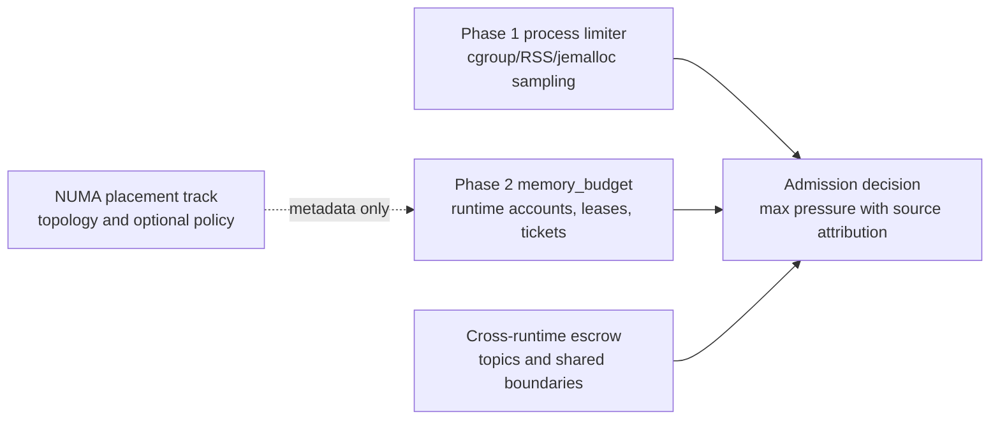
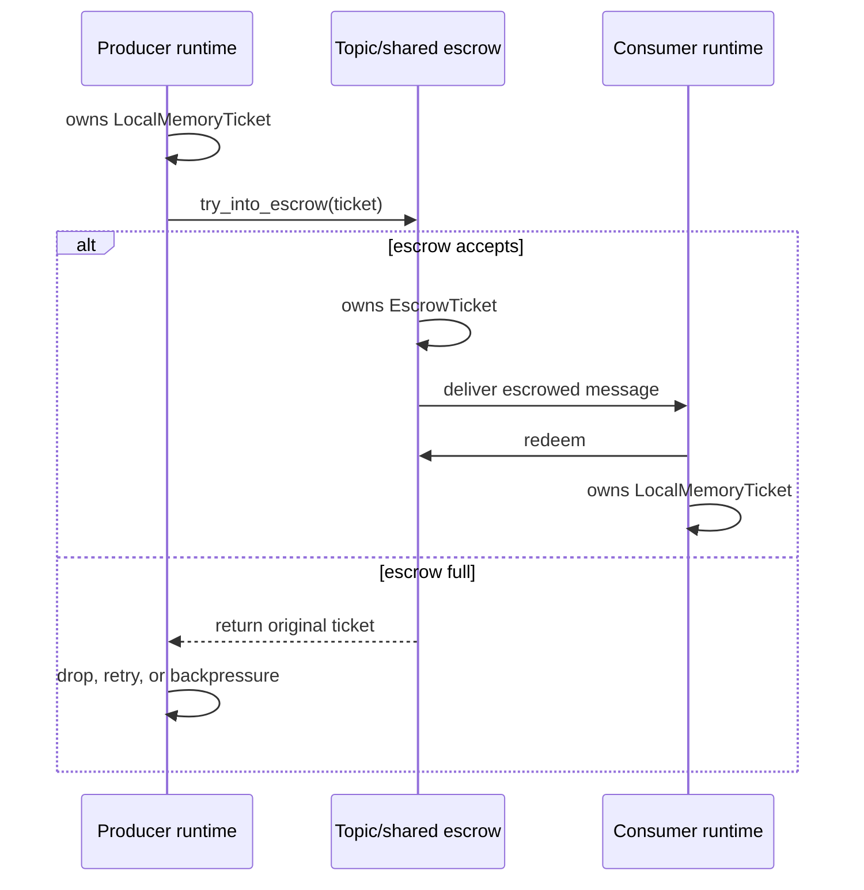

# Memory Limiter - Phase 2 Design

This document proposes Phase 2 of the df-engine memory limiter. Phase 1 is a
process-wide observed-memory limiter that samples process or cgroup memory and
sheds receiver ingress under `Hard` pressure. Phase 2 adds structured
per-runtime memory accounting and soft enforcement while keeping the Phase 1
process limiter as the outer safety net.

This is a design document. It intentionally does not describe a patch to the
current implementation.

In short:

- Phase 1 already provides a process-wide memory pressure guardrail.
- Phase 2's main feature is per-runtime memory budgeting across cores.
- NUMA-aware allocation is a related placement option, not the budget itself.

## Goals

Phase 2 should provide:

- Per-runtime attribution for retained memory.
- Fairness between pipeline runtime instances on different cores.
- Earlier and more local backpressure than a process-wide pressure signal.
- Bounded local hot-path overhead on the current-thread runtime.
- Correct ownership transfer when data crosses runtime or topic boundaries.
- Clear separation between logical memory ownership and physical allocator
  residency.
- Optional NUMA locality support as a placement feature, not as a memory limit.

Phase 2 should preserve these Phase 1 properties:

- The process-wide limiter remains the final container/process safety net.
- Receiver hot paths do not consult a process-wide sampler.
- Operators can roll out observability before enforcement.
- Unsupported platforms degrade explicitly rather than silently changing
  semantics.

## Non-Goals

Phase 2 does not provide a hard OS-enforced per-runtime memory quota. A single
df-engine process has one address space and one global heap. Inside that
process, per-runtime control is cooperative accounting and admission control.

Phase 2 also does not:

- Replace cgroups, Kubernetes memory limits, or systemd memory controls.
- Treat allocator resident bytes as the enforcement source of truth.
- Enforce on every allocation made by `Vec`, `Box`, Tokio, tonic, hyper, or
  third-party libraries.
- Require Linux NUMA support for correctness.
- Require jemalloc for the logical accounting design.
- Charge temporary scratch memory that is allocated and released within one
  poll turn unless it is retained across an await, queue, or state boundary.

## Current Runtime Shape

The controller launches one pipeline runtime instance per resolved core
assignment. Each instance runs on one OS thread, pins that thread with
`core_affinity::set_for_current`, and then drives a Tokio current-thread
runtime with a `LocalSet`. This shape is a good fit for local accounting because
many hot-path local nodes and effect handlers already stay on one runtime
thread.

The engine also has shared nodes, shared channels, topics, ack/nack paths, and
`PData` bounds that include `Clone + Send + Sync` at controller and topic
boundaries. Phase 2 must respect that split. Local memory-account handles can be
`!Send`, but they must not be embedded directly in `PData` or any type that can
cross a shared boundary.

The current memory limiter is process-wide:

- A controller task samples process/cgroup/RSS/jemalloc-resident memory.
- It classifies memory pressure as `Normal`, `Soft`, or `Hard`.
- It broadcasts `MemoryPressureChanged` to pipeline runtimes.
- Receivers keep local admission state and shed ingress under process `Hard`.

Phase 1 explicitly leaves these Phase 2 items for later:

- queue and topic byte accounting
- per-pipeline memory budgets
- per-core local leases with bounded overshoot
- `MemoryTicket` ownership on retained work items
- reclaim hooks for stateful components
- OTAP stream-state accounting and recycling

## Design Principles

### Keep Process Pressure and Runtime Budgets Separate

Process pressure answers: "Is the process or container close to its memory
limit?"

Runtime budget pressure answers: "Has this runtime instance exceeded its fair
share or local lease?"

The signals should be stored separately and combined only at admission:

```text
effective_pressure = max(
    process_pressure,        // local cached Phase 1 watch value
    runtime_budget_pressure,
    escrow_pressure,         // max over boundaries this runtime publishes to
)
```

Metrics and logs must preserve the source so operators can distinguish a
process-wide safety event, a single noisy runtime, and a saturated
cross-runtime boundary.

The runtime must not read the process-wide sampler on the hot path. The
`process_pressure` input is the receiver/runtime-local cached watch value from
Phase 1. `escrow_pressure` is scoped to boundaries the runtime publishes to or
owns; it is not a max across all process escrows.

### Use Logical Ownership for Enforcement

The enforcement number should be logical retained bytes, not allocator resident
bytes. A retained item owns a ticket. Dropping the item drops the ticket and
returns the charge.

This is necessary because pdata can cross cores. If a batch is allocated on
runtime A and consumed by runtime B, allocator resident memory may still be
attributed to A, but logical ownership has moved to B or to an intermediate
topic/queue. Enforcement should follow ownership, not the allocator arena that
originally served the allocation.

### Keep Hot Paths Local and Coordination Coarse

The common case should mutate local `Cell` state on the current-thread runtime.
Shared atomics are acceptable for:

- lease refill/return in coarse chunks
- metrics snapshots
- cross-runtime escrow queues
- controller-visible status

They should not be required for every charged byte or every receiver ingress
check.

Lease and escrow coordination must be chunked. A runtime should borrow from the
global pool in `lease_step_bytes` blocks, not one byte at a time. A runtime
should return borrowed capacity lazily when charged bytes fall below a low
watermark, not on every ticket drop. Escrow should maintain local queued-byte
state and publish batched atomic deltas where possible. A good implementation
target is:

- no global atomic on the common charge path below the local lease
- at most two local `Cell` mutations per retained item
- at most one global coordination event per `lease_step_bytes`
- no budget acquisition for release, drop, drain, or control-plane cleanup

### Never Block Reclaim or Release

Memory pressure handling must not deadlock. Releasing, dropping, draining,
reclaiming, and sending shutdown/control messages must not require acquiring
more memory budget. Admission may fail; cleanup must not.

### Roll Out Observe-Only First

Every new accounting layer should support `observe_only` mode before it can
enforce. This mirrors Phase 1 and gives operators time to validate skew,
retained byte estimates, and pressure transitions.

## Proposed Architecture

Add a new module instead of overloading the Phase 1 limiter:

```text
crates/engine/src/memory_budget/
    mod.rs
    account.rs
    admission.rs
    escrow.rs
    lease.rs
    metrics.rs
    ticket.rs
```

The module owns per-runtime logical accounting. Phase 1
`memory_limiter.rs` remains the process pressure implementation.

NUMA topology and placement should live in a sibling resource-placement module
or a future `memory-placement.md` design. It is discussed later only because
runtime budget metrics should carry real `numa_node_id` when available.



### Core Types

```rust
pub enum BudgetMode {
    ObserveOnly,
    Enforce,
}

pub enum BudgetLevel {
    Normal,
    Soft,
    Hard,
}

pub struct RuntimeMemoryAccount {
    deployment_key: DeployedPipelineKey,
    floor_bytes: u64,
    soft_bytes: u64,
    hard_bytes: u64,
    charged_bytes: Cell<u64>,
    peak_bytes: Cell<u64>,
    level: Cell<BudgetLevel>,
    lease: LocalMemoryLease,
}

pub struct LocalMemoryLease {
    borrowed_bytes: Cell<u64>,
    lease_step_bytes: u64,
    return_low_watermark_bytes: u64,
}

pub struct GlobalLeasePool {
    spare_bytes: AtomicU64,
    max_overshoot_per_runtime: u64,
}

#[must_use]
pub struct LocalMemoryTicket {
    bytes: u64,
    account: Rc<RuntimeMemoryAccount>,
    generation: u64,
}

pub struct EscrowTicket {
    bytes: u64,
    escrow: Arc<CrossRuntimeEscrow>,
}
```

The exact names can change during implementation. The important split is:

- `RuntimeMemoryAccount` is local and `!Send`.
- `GlobalLeasePool` coordinates bounded overshoot.
- `LocalMemoryTicket` owns a logical charge while data is retained locally.
- `EscrowTicket` owns a charge while data is in a cross-runtime boundary.

### Ticket Attachment

Tickets must not be embedded in `PData`. `PData` is `Clone + Send + Sync` at
controller, topic, and shared-node boundaries, while a local ticket contains
`Rc<RuntimeMemoryAccount>` and is intentionally `!Send`.

Phase 2 should use an engine-owned envelope as the default attachment strategy.
A side table keyed by message id is allowed only as an explicit optimization for
channels or topics that already have stable message ids and document why an
envelope is not suitable.

Attachment rules:

- Local channels may carry a local envelope that pairs `PData` with
  `LocalMemoryTicket`.
- Shared channels and topics must not carry `LocalMemoryTicket`.
- Publishing across a shared boundary must consume the local ticket and produce
  a sendable `EscrowTicket`.
- Receiving from escrow must redeem the escrow into the consumer runtime's
  local account before the message becomes locally retained.
- Return-path data-bearing control messages, such as ack/nack with `PData`,
  follow the same rule: local return paths keep local tickets; shared return
  paths must convert ownership to escrow before crossing.
- Failed sends must return the original owner: local ticket, escrow ticket, or
  uncharged `PData`, depending on the state before the send attempt.

This type-state boundary is the design invariant. It prevents a `!Send` ticket
from entering a `SharedSender` while preserving the existing `PData` bounds.

## Budget Model

### Initial Sizing

The process-wide hard limit is not leased out entirely. The controller reserves
headroom for:

- admin server and control plane
- telemetry system
- process-wide sampler
- allocator metadata and fragmentation
- uncharged short-lived scratch memory
- OS and runtime overhead

The remainder is distributed as local floor leases.

An internal telemetry pipeline must be funded exactly once. It can either be
covered by reserved headroom as shared system overhead, or it can participate as
a normal runtime with its own floor. It should not be counted in both.

Example:

```yaml
policies:
  resources:
    memory_limiter:
      mode: enforce
      source: auto
    memory_budget:
      mode: observe_only
      sizing:
        strategy: leased
        reserve: 512 MiB
        floor_per_runtime: 256 MiB
        max_overshoot_per_runtime: 128 MiB
```

If `floor_per_runtime` is omitted, the controller can derive it from:

```text
(process_hard_limit - reserve) / active_runtime_count
```

Here `active_runtime_count` means the total number of resolved runtime
instances in this df-engine process, summed across all regular pipelines and
any internal telemetry pipeline that participates in the budget. If no process
hard limit is known, derived sizing is not available; the config must provide
explicit `floor_per_runtime` and `reserve` values or remain disabled.

Explicit sizing should override derived sizing for production deployments that
know workload shape.

### Elastic Leases

Equal hard partitions are too rigid. A runtime should have:

- a guaranteed local floor
- a bounded overshoot allowance
- access to a shared spare pool when other runtimes are idle

The common path charges against the local floor. When the runtime crosses its
floor, it requests a lease extension from `GlobalLeasePool`. If borrowing
succeeds, the runtime continues. If borrowing fails and the runtime crosses its
configured hard threshold, local `Hard` pressure is set.

This gives fairness without leaving unused memory stranded on idle runtimes.

### Lease Mechanics

The lease policy must define coarse refill and return behavior:

- `floor_bytes` is guaranteed local capacity.
- `soft_bytes` is the point where the runtime reports `Soft`.
- `hard_bytes` is the point where the runtime reports `Hard` if borrowing
  cannot cover the excess.
- `hard_bytes` must be no greater than
  `floor_bytes + max_overshoot_per_runtime`.
- `lease_step_bytes` controls global-pool borrow granularity.
- `return_low_watermark_bytes` controls when borrowed capacity is returned.

Recommended defaults:

```text
lease_step_bytes = max(64 KiB, floor_bytes / 16)
return_low_watermark_bytes = lease_step_bytes / 2
```

When charged bytes cross the currently leased capacity, the runtime borrows one
or more `lease_step_bytes` chunks. When charged bytes later fall far enough
below the leased capacity, it returns whole chunks lazily. Borrowed bytes are
tracked separately from charged bytes so metrics can explain whether a runtime
is large because of real retention or because capacity has not yet been
returned.

### Pressure Semantics

Runtime budget pressure has different meaning from process pressure:

<!-- markdownlint-disable MD013 -->
| Level | Meaning | Default behavior |
| --- | --- | --- |
| `Normal` | Charged bytes are within local budget. | Admit normally. |
| `Soft` | Runtime is above soft budget or consuming borrowed lease. | Continue, emit metrics/logs. |
| `Hard` | Runtime exceeded hard budget and cannot borrow. | Shed new local ingress in enforce mode. |
<!-- markdownlint-enable MD013 -->

Process `Hard` still overrides runtime state because it protects the whole
process or container.

### Budget Arithmetic

Floors are guaranteed. Overshoot is best-effort.

```text
0 < floor_bytes <= soft_bytes < hard_bytes
hard_bytes <= floor_bytes + max_overshoot_per_runtime
spare_pool_bytes = process_hard_limit - reserve - sum(floor_bytes)
```

If `spare_pool_bytes` is zero, a runtime can still operate within its floor but
cannot borrow. If a resize lowers a runtime's floor below its current charge,
the runtime should be grandfathered into `Soft` and asked to drain or reclaim
before it is classified as `Hard`, unless process pressure is already `Hard`.

The global logical invariant is:

```text
sum(runtime_charged_bytes) + sum(escrow_charged_bytes)
    <= process_budget - reserve + allowed_overshoot
```

Floors are admission guarantees, not permanently carved physical reservations.
Moving bytes from a runtime account into escrow should transfer logical
ownership without increasing the global logical total. If the spare pool has
fewer than `lease_step_bytes` available, the default policy is to refuse the
borrow rather than issue a partial chunk; this preserves coarse coordination and
keeps the final small remainder as process headroom.

## Ticket Ownership

Tickets are the enforcement source of truth. A ticket is attached to data or
state that is retained beyond immediate stack-local work.

Invariant: anything retained across an await, queue, topic, retry, durable
buffer, delayed work, stream state, or component-state boundary must have
exactly one logical owner. Pure stack-local scratch that is released within one
poll turn is not charged.

### Charge Sizing Model

Phase 2 charges logical retained size. It must not use allocator allocation
size, `size_of_val`, jemalloc arena stats, RSS deltas, or cgroup usage as the
ticket size.

Implement a sizing contract such as:

```rust
pub trait ChargedSize {
    fn charged_size_bytes(&self) -> u64;
}
```

Allowed charge sources:

- encoded payload byte length, such as `OtapPayload::num_bytes`
- declared serialized byte length
- queue/topic envelope payload size
- component-owned retained buffer length
- component-specific retained-state estimate documented by that component

Forbidden charge sources:

- allocator resident bytes
- allocator usable-size APIs
- process RSS or cgroup usage
- `std::mem::size_of::<T>()` or `size_of_val`
- Rust struct layout size
- inferred deltas from memory samples

If a component cannot compute a retained size, it must either use a conservative
documented estimate or remain excluded from enforcement until it can report one.
Enforcement must not be enabled on a route whose retained charge size is
unknown unless that route is explicitly excluded from the budget policy.

### Fanout and Shared-Buffer Semantics

Arrow and `Bytes` payloads can be shallow-cloned. That means multiple logical
owners may share the same physical bytes. Phase 2 deliberately charges per
retained logical owner, not per underlying allocation.

Consequences:

- A fanout with `N` retained branches charges up to `N * payload_bytes`.
- Logical charged bytes can exceed process resident bytes.
- Floor and overshoot sizing are fairness controls, not exact resident-memory
  partitioning.
- Metrics should expose charged bytes and sampled process memory separately.

For deep copies, each new retained copy also requires its own charge.

Processor fanout and topic broadcast are different ownership shapes. Processor
fanout materializes retained branches and should reserve one logical owner per
branch. The current topic backend stores sendable `Arc<T>` envelopes in a
process-global broker/ring, so the first topic-budget implementation should
charge broadcast by ring-slot occupancy and release on eviction, disconnect, or
final delivery cleanup. Per-subscriber virtual branch tickets are a possible
future extension, but they require explicit subscriber-cursor ownership rather
than the current shared ring-slot model.

### Charge Sites

Phase 2 should charge these retention sites:

<!-- markdownlint-disable MD013 -->
| Site | Charge rule |
| --- | --- |
| Receiver ingress | Acquire provisional or final ticket before accepting retained work. |
| Local data envelope | Engine-owned local envelope carries `PData` plus `LocalMemoryTicket`. |
| Local channel queue | Queue owns the local envelope while the item is buffered. |
| Shared channel queue | Sender converts local ownership into sendable escrow before enqueue. |
| Topic queue | Current broker topics own sendable escrow; runtime-local topics require a new backend. |
| Fanout/clone | Reserve one logical owner per retained branch. |
| Batch processor | Retains tickets for buffered items and adjusts to batch size. |
| Retry buffer | Owns tickets for retained retry payloads. |
| Durable buffer | Owns tickets until payload is durably handed off or released. |
| OTAP stream state | Charges retained stream buffers and recyclable state. |
| Delayed local work | Retained delayed payload keeps its ticket until delivered or dropped. |
| Ack/Nack with pdata | Return-path pdata keeps existing ownership; no fresh budget is required. |
<!-- markdownlint-enable MD013 -->

Pure control messages such as shutdown, configuration, timer ticks, telemetry
collection, and drain requests must never require memory budget. Control
messages that carry `PData`, such as ack/nack and delayed data, are
data-bearing control messages and must preserve existing ticket ownership
without requiring a new reservation.

APIs that currently retain `Box<PData>`, such as delayed local scheduling,
would need a charged envelope or side-table entry. They should not accept raw
retained pdata in enforce mode unless a ticket is associated with that
retention.

### Size Adjustment

Some components change retained size. They should update the ticket:

```rust
impl LocalMemoryTicket {
    pub fn try_reserve_extra(&mut self, extra_bytes: u64) -> Result<(), BudgetError>;
    pub fn reconcile_size(&mut self, new_bytes: u64);
    pub fn try_reserve_clone(&self, bytes: u64) -> Result<LocalMemoryTicket, BudgetError>;
    pub fn try_into_escrow(
        self,
        escrow: &Arc<CrossRuntimeEscrow>,
    ) -> Result<EscrowTicket, (Self, EscrowFull)>;
}
```

Growing retained memory requires reserving before the grow:

1. Call `try_reserve_extra(extra_bytes)`.
2. Grow the retained buffer or state only if reservation succeeds.
3. Call `reconcile_size(new_bytes)` after the exact final size is known.

`reconcile_size` is infallible. If it observes that retained memory grew beyond
the reserved amount, it records an overshoot metric/event and updates the
logical charge. It must not reject after the allocation has already happened.
After reconciliation, the account immediately re-evaluates pressure from the
updated `charged_bytes`. If the overshoot pushes the runtime past `hard_bytes`,
the runtime transitions to local `Hard` for subsequent admission checks and
should request reclaim or drain. In-flight retained work is not retroactively
rejected.

Component-specific behavior applies when reservation fails before growth:

- receivers can reject before accepting more work
- queues can refuse publish
- processors can request drain/reclaim or stop buffering
- exporters can apply backpressure or fail according to existing policy

Shrinking or dropping a ticket must always succeed.

Repeated reconciliation overshoot is budget debt. The policy should define an
`overshoot_debt_limit`; exceeding it forces local `Hard`, emits a warning, and
disables further growth reservations for that runtime until reclaim or drop
brings the account back under budget.

For fanout, `try_reserve_clone` reserves a new logical owner for each retained
branch. It does not split one charge into smaller parts unless the payload
itself is physically partitioned into smaller retained payloads.

## Cross-Runtime Escrow

Cross-runtime handoff is the main correctness issue. A naive design that drops
the producer charge before the consumer reserves a new charge creates an
unowned interval. A design that keeps the producer charged forever misattributes
consumer-retained work.

Escrow solves this:

1. Producer converts `LocalMemoryTicket` into `EscrowTicket` when publishing to
   a cross-runtime topic or queue.
2. The escrow account owns the charge while the message is in transit.
3. Consumer redeems the escrow into its local `LocalMemoryTicket`.
4. If redemption fails in enforce mode, the queue applies its configured drop,
   retry, or backpressure behavior.



Escrow accounts are not generation-scoped. On `try_into_escrow`, ownership
leaves the producer runtime generation immediately and moves to the escrow
account. On redeem, ownership moves from escrow to the consumer runtime
generation. A producer or consumer generation ending must not leak escrowed
bytes.

Escrow has real pressure:

- escrow bytes count against a topic or boundary limit
- escrow bytes reduce available global spare capacity while in transit
- escrow pressure participates in `effective_pressure`

The current topic broker is process-global, `Send + Sync`, and stores `Arc<T>`
payloads. Therefore current broker topics are escrow-backed boundaries even when
the producer and consumer happen to run on the same runtime. Keeping local
tickets in a topic requires a new runtime-local topic backend.

`try_into_escrow` must return the original ticket on failure:

```rust
fn try_into_escrow(
    self,
    escrow: &Arc<CrossRuntimeEscrow>,
) -> Result<EscrowTicket, (LocalMemoryTicket, EscrowFull)>;
```

This lets the caller apply the topic or queue's policy without losing
accounting ownership.

`EscrowTicket::drop` should not silently release accounting as if delivery had
succeeded. Dropping an unresolved escrow ticket records an abandoned escrow
entry in a leak-detection graveyard with a deadline. A normal abort, eviction,
or tracked negative outcome should release escrow explicitly before drop.

Existing channel `SendError<T>` shapes should be reused where possible by
making `T` the local or escrow envelope. Phase 2 should not introduce a
parallel ticket-aware send-error hierarchy unless the existing returned-item
semantics are insufficient.

### Redemption Progress Guarantee

Consumers must be able to make forward progress under local `Hard` pressure.
Otherwise a full consumer budget can prevent redemption, which prevents
dequeue, which prevents release, which fills escrow and stalls producers.

Each runtime should reserve a small redemption/drain allowance that can redeem
at least one in-transit item or a bounded byte amount even when the runtime is
otherwise at local `Hard`. This allowance is only for consuming, dropping,
aborting, or draining already-admitted work. It must not admit new external
ingress.

The default allowance should be per runtime and carved out of `floor_bytes` so
sizing accounts for it. It should be at least:

```text
max(lease_step_bytes, largest_configured_topic_message_estimate)
```

Bytes redeemed through this allowance are still charged to the consumer runtime.
The allowance only permits redemption/drain progress while the runtime remains
at local `Hard`; it does not make the work uncharged and does not admit new
external ingress.

If the allowance is exhausted, the consumer should be able to abort the delivery
without acquiring budget. Abort/drop releases escrow ownership and reports the
configured topic outcome.

Balanced queues and broadcast rings release escrow differently:

- balanced delivery redeems on delivery, then commits or aborts exactly one
  item
- broadcast ring occupancy owns escrow until eviction, disconnect, or final
  subscriber release according to the topic policy
- lag/drop-oldest releases the evicted ring slot's escrow and records the
  configured lag outcome

### Failed-Send Lifecycle

Every boundary must have exactly one owner at all times:

<!-- markdownlint-disable MD013 -->
| Operation | Success | Failure |
| --- | --- | --- |
| Local channel send | Queue owns local ticket. | Caller receives original local ticket with message. |
| Shared channel send | Queue owns escrow ticket. | Caller receives original local ticket or escrow ticket. |
| Topic publish | Topic escrow owns charge. | Publisher keeps original local ticket. |
| Topic delivery redeem | Consumer owns local ticket. | Delivery can abort/drop and release escrow. |
| Ack/Nack unwind | Existing ticket follows returned pdata. | Sender keeps returned pdata and ticket. |
<!-- markdownlint-enable MD013 -->

The implementation should encode these transitions in result types instead of
requiring callers to reconstruct ownership after an error.

### Alternatives Considered

Producer-retains-charge is simpler: the producer keeps its local charge until
the consumer ack/nack completes. It avoids escrow-generation complexity but
misattributes consumer-retained work and can pin producer budget for slow
consumers.

Boundary-only accounting charges queue/topic depth instead of every retained
item. It is less invasive and may be a useful initial observability phase, but
it cannot attribute retained processor state, retry buffers, delayed work, or
stream state.

Out-of-band side tables keyed by message id avoid modifying `PData` and are
compatible with the chosen type-state model. They are an implementation option
for the local envelope/escrow boundary, with extra lookup cost.

Escrow metrics should make boundary pressure visible:

- current escrow charged bytes
- publish refusals due to escrow full
- redemption failures
- oldest retained age
- per-topic or per-route attribution

## Admission Model

Receivers should consume a single admission API that combines process pressure,
runtime budget pressure, and optional estimated bytes:

```rust
pub enum AdmissionDecision {
    Admit,
    AdmitWithTicket(LocalMemoryTicket),
    Shed {
        level: BudgetLevel,
        source: AdmissionPressureSource,
        retry_after_secs: u32,
    },
}

pub enum AdmissionPressureSource {
    ProcessHard,
    RuntimeBudgetHard,
    EscrowFull,
}
```

`Admit` without a ticket is only valid for work that releases its memory within
one poll turn and does not cross an await, queue, topic, retry, durable-buffer,
delayed-work, stream-state, or component-state boundary. Any retained work must
use `AdmitWithTicket` or an equivalent charged owner.

`retry_after_secs` comes from the source:

- `ProcessHard` uses the Phase 1 memory limiter retry setting.
- `RuntimeBudgetHard` uses `memory_budget.retry_after_secs`.
- `EscrowFull` uses the topic or boundary policy, falling back to the memory
  budget retry setting.

Escrow pressure is most precise at publish time. Receiver admission should use
`EscrowFull` only for downstream boundaries owned by, or directly attributable
to, that receiver/runtime. It should not shed unrelated ingress because some
other process-wide topic is full.

Admission should have up to three checkpoints:

1. **Pre-decode:** reject immediately if effective pressure is `Hard`.
2. **Estimated reserve:** reserve from content length, frame size, or known
   payload size when available.
3. **Final adjust:** update the ticket after exact retained bytes are known.

This keeps expensive decode work out of the system when pressure is already
known and improves attribution once exact sizes are available.

## NUMA Placement Appendix

NUMA locality is valuable for this engine because the runtime model already has
one pinned OS thread per runtime instance. On Linux, the default policy often
gives useful locality through first-touch placement when pages are first
written by the pinned runtime thread.

NUMA locality is still separate from memory isolation:

- NUMA answers where physical pages should be allocated.
- Memory budget answers how many logical retained bytes a runtime may own.

Phase 2 should treat NUMA as placement metadata and optional policy.

NUMA placement is an orthogonal resource-placement track. The memory-budget
design does not depend on it. If this section grows beyond topology metadata
and optional thread placement, it should move into a separate
`memory-placement.md` document.

### NUMA Topology Discovery

Add a small topology abstraction:

```rust
pub struct NumaTopology {
    pub nodes: Vec<NumaNode>,
    pub node_for_core: HashMap<usize, usize>,
}

pub trait NumaTopologyBackend {
    fn discover(&self) -> Result<NumaTopology, NumaError>;
}
```

Initial backend:

- Linux `/sys/devices/system/cpu/cpu*/node*` or
  `/sys/devices/system/node/node*/cpulist`

Fallback:

- single synthetic NUMA node on unsupported platforms
- explicit unsupported status for operators who request strict placement

### NUMA-Aware Core Planning

The highest-value NUMA feature is topology-aware core selection. Add a resource
policy that can pack or spread runtime instances by NUMA node:

```yaml
policies:
  resources:
    core_allocation:
      type: numa_aware
      count: 8
      placement: pack   # pack | spread
```

Semantics:

- `pack`: choose cores from the fewest NUMA nodes possible.
- `spread`: distribute cores across NUMA nodes for memory bandwidth or fairness.
- `core_set`: remains explicit and is not reordered.

Planning must be global across all resolved pipelines, not greedy per pipeline.
If every packed pipeline starts on NUMA node 0, the planner creates imbalance.
The controller should use remaining node capacity across the whole deployment
and log when a requested pipeline necessarily spans NUMA nodes.

### Optional Thread Memory Policy

Add a separate placement policy:

```yaml
policies:
  resources:
    memory_placement:
      mode: local_to_cpu     # disabled | local_to_cpu | preferred_node | bind_node
      unsupported: warn      # warn | error | ignore
```

Apply in this order inside the pipeline thread:

1. pin CPU affinity
2. apply memory placement policy
3. build runtime-local state
4. create the Tokio current-thread runtime
5. start node tasks

Default should be `local_to_cpu` or preferred local allocation when enabled.
Strict bind should be opt-in only. Strict binding can fail or trigger OOM-like
behavior even when other NUMA nodes have available memory.

Allocations performed before the pipeline thread is pinned and before memory
policy is applied keep the controller or creator thread's placement behavior.
That is acceptable for shared control-plane state, telemetry registry state,
and other process-level objects. The engine should not promise NUMA locality for
objects constructed before pipeline-thread startup.

### Allocator Interaction

Allocator arenas are useful for observability and locality but should not be
the enforcement source of truth.

With jemalloc, per-arena stats and per-arena purge can help answer:

- how much resident memory is associated with an arena
- whether allocator retention is causing local physical pressure
- whether a targeted purge helps

They do not reliably answer:

- which runtime logically owns a cross-core batch
- how much live retained pdata a runtime owns
- whether a consumer should shed ingress

Optional jemalloc integration should be deferred until logical accounting is in
place. If added, it should publish allocator-resident metrics and optional purge
events, not replace `LocalMemoryTicket` accounting.

Allocator resident bytes must never be summed with logical charged bytes in
admission, metrics, or pressure classification. They are a separate diagnostic
signal for fragmentation, allocator retention, and targeted purge decisions.

## Configuration

Additive resource policy:

```yaml
policies:
  resources:
    memory_limiter:
      mode: enforce
      source: auto
    memory_budget:
      mode: observe_only
      retry_after_secs: 1
      sizing:
        strategy: leased
        reserve: 512 MiB
        floor_per_runtime: 256 MiB
        lease_step: 64 KiB
        max_overshoot_per_runtime: 128 MiB
        overshoot_debt_limit: 16 MiB
      escrow:
        topic_default_limit: 64 MiB
      enforcement:
        receiver_admission: false
        queue_publish: false
        reclaim_hooks: false
    memory_placement:
      mode: local_to_cpu
      unsupported: warn
```

Validation:

- `memory_budget` is supported only at top-level `policies.resources`.
- `memory_budget.mode` is required when configured.
- `reserve` must be smaller than the process hard limit when a hard limit is
  known.
- `runtime_count` is the total resolved runtime instances in the process.
- `floor_per_runtime * runtime_count + reserve` must not exceed the process
  hard limit in `enforce` mode.
- If no process hard limit is known, derived sizing is unavailable and
  `floor_per_runtime` must be explicit.
- `max_overshoot_per_runtime` must be bounded.
- `lease_step` must be greater than zero and no larger than
  both `floor_per_runtime` and half of `max_overshoot_per_runtime`, so at
  least two borrow chunks fit inside the overshoot allowance.
- `overshoot_debt_limit` must be bounded and smaller than
  `max_overshoot_per_runtime`.
- `memory_placement.bind_node` requires Linux NUMA support and explicit
  unsupported handling.

The policy should be ignored by `ResolvedPolicies::eq_ignoring_resources`, just
like other resource placement and scaling controls.

## Metrics

Add runtime/generation-scoped metrics:

<!-- markdownlint-disable MD013 -->
| Metric | Description |
| --- | --- |
| `engine.runtime_memory.charged_bytes` | Logical bytes charged to the runtime. |
| `engine.runtime_memory.peak_charged_bytes` | Peak logical bytes since runtime start. |
| `engine.runtime_memory.floor_bytes` | Guaranteed local floor. |
| `engine.runtime_memory.borrowed_bytes` | Bytes borrowed from the global lease pool. |
| `engine.runtime_memory.overshoot_bytes` | Bytes reconciled after growth without prior reservation. |
| `engine.runtime_memory.level` | Runtime budget pressure state. |
| `engine.runtime_memory.outstanding_tickets` | Number of live local tickets. |
| `engine.runtime_memory.oldest_ticket_age_ms` | Age of the oldest live local ticket. |
| `engine.runtime_memory.lease_borrows` | Count of successful lease borrows. |
| `engine.runtime_memory.lease_failures` | Count of failed lease borrows. |
| `engine.runtime_memory.rejections` | Rejections by local memory budget. |
| `engine.escrow_memory.charged_bytes` | Logical bytes owned by an escrow boundary. |
| `engine.escrow_memory.rejections` | Publish or redemption failures by escrow. |
| `engine.global_memory.runtime_charged_bytes` | Sum of runtime logical charges. |
| `engine.global_memory.escrow_charged_bytes` | Sum of escrow logical charges. |
| `engine.global_memory.spare_available_bytes` | Remaining global spare pool. |
| `engine.numa.node_id` | NUMA node assigned to the runtime core. |
| `engine.allocator.arena_resident_bytes` | Optional jemalloc arena resident bytes. |
<!-- markdownlint-enable MD013 -->

Metric attributes should include:

- `pipeline_group_id`
- `pipeline_id`
- `core_id`
- `deployment_generation`
- `numa_node_id`, when known
- `source`, for rejection and pressure source metrics

Metrics backed by local `Cell` state must be snapshotted on the pipeline runtime
thread. Cross-thread metric consumers should read a separately published atomic
or registry snapshot. Expensive ticket cardinality metrics such as
`outstanding_tickets` and `oldest_ticket_age_ms` are observe-only diagnostics or
feature-gated debug metrics; they must not add ordered per-ticket tracking to
the enforce hot path by default.

## Structured Events

Add events that mirror Phase 1 naming style:

<!-- markdownlint-disable MD013 -->
| Event | Level | Description |
| --- | --- | --- |
| `runtime_memory_budget.transition` | info/warn | Runtime budget level changed. |
| `runtime_memory_budget.lease_borrow` | info | Runtime borrowed from global spare pool. |
| `runtime_memory_budget.lease_failed` | warn | Runtime could not borrow needed lease. |
| `runtime_memory_budget.rejection` | warn | Admission or publish rejected by local budget. |
| `runtime_memory_budget.ticket_adjust_failed` | warn | Retained item could not grow its ticket. |
| `runtime_memory_escrow.rejection` | warn | Escrow boundary refused or failed redemption. |
| `numa.topology.detected` | info | NUMA topology discovered. |
| `numa.placement.applied` | info | Runtime thread memory policy applied. |
| `numa.placement.failed` | warn/error | Requested placement could not be applied. |
<!-- markdownlint-enable MD013 -->

## Reclaim Hooks

Receiver shedding alone is not enough because memory pressure can originate
inside the graph after ingress admission. Stateful components should eventually
support reclaim hooks:

```rust
pub enum ReclaimPriority {
    Queue,
    Processor,
    Buffer,
    Stream,
}

pub struct ReclaimContext<'a> {
    // Exposes budget-free drop, drain, abort, and release primitives only.
    _private: &'a (),
}

pub struct ReclaimResult {
    released_bytes: u64,
    more_available: bool,
}

#[async_trait::async_trait(?Send)]
pub trait LocalMemoryReclaim {
    fn reclaim_priority(&self) -> ReclaimPriority;
    async fn reclaim(
        &mut self,
        target_bytes: u64,
        context: ReclaimContext<'_>,
    ) -> ReclaimResult;
}
```

Candidate components:

- batch processors
- retry buffers
- durable buffer processors
- topic queues
- OTAP stream state
- delayed local scheduler payloads

Reclaim must be best-effort and bounded. It must not require additional budget
to release memory. The reclaim context should not expose reservation APIs; it
should expose only release paths. Shared components can add a separate
`SharedMemoryReclaim` variant if needed, mirroring the engine's local/shared
node split.

Reclaim ordering should be deterministic. The engine should ask reclaimers in
`ReclaimPriority` order, use a fixed component-kind tie breaker, and stop once
the target byte count is met or all reclaimers report no progress.

## Live Reconfiguration

Budget state must be generation-scoped. A runtime instance key includes
`deployment_generation`, and memory accounts should use the same key.

On replacement:

- old runtime retains its account until drained or terminated
- new runtime receives a new account and generation
- global lease pool accounts for both during overlap
- metrics remain distinguishable by generation
- local tickets tied to the old generation keep refunding to the old account
  until that account closes
- escrow tickets are not tied to the producer or consumer generation and remain
  owned by the escrow account until redeemed, aborted, or dropped

On resize:

- the controller recomputes runtime count and lease sizing
- existing runtime accounts receive updated soft/hard/floor settings through
  control-plane messages
- shrinking floors should be grandfathered and drained down instead of pushing
  existing runtimes immediately to local `Hard`
- enforcement changes should preserve observe-only safety during rollout

On runtime teardown:

- local queues drop local tickets as part of normal drain or abort
- in-transit escrow is either redeemed by a live consumer or released by abort
- abandoned escrow moves to a leak-detection graveyard with timeout-based
  metrics so shutdown cannot hide accounting drift
- pure control-plane shutdown must not acquire memory budget

## Platform Support

Logical memory budgets are platform-independent.

NUMA placement is platform-specific:

<!-- markdownlint-disable MD013 -->
| Platform | Support |
| --- | --- |
| Linux | Topology discovery and optional thread memory policy. |
| Windows | Future topology backend possible; no initial thread policy requirement. |
| macOS | Treat as single-node/no-op for this feature. |
| Other Unix | Single-node/no-op unless a backend is added. |
<!-- markdownlint-enable MD013 -->

Unsupported placement should default to `warn`, not startup failure. Operators
who require placement can choose `unsupported: error`.

## Phased Rollout

### Phase 2a: Design and Observability

- Add this design doc.
- Add NUMA topology discovery in the parallel placement track if runtime NUMA
  attributes are desired for metrics.
- Populate real runtime `numa_node_id` when the placement track is available.
- Add runtime memory budget config in disabled/observe-only mode.
- Add `RuntimeMemoryAccount` and metrics with manual or coarse charge points.
- No behavior change.

### Phase 2a.5: Coarse Logical Accounting

- Add manual charges at receiver ingress and selected retained buffers.
- Add queue/topic byte-depth observability.
- Validate charged bytes, resident bytes, and process samples side by side.
- Continue observe-only.

### Phase 2b: Ticket Ownership

- Add `LocalMemoryTicket`.
- Add local envelopes or side tables; do not modify `PData`.
- Add ticket adjustment for known size changes.
- Add cross-runtime `EscrowTicket` for topics and queues.
- Continue observe-only.

### Phase 2c: Receiver Enforcement

- Add combined `AdmissionDecision`.
- Keep current process `Hard` receiver shedding.
- Optionally shed receiver ingress for runtime budget `Hard` behind a separate
  `receiver_admission` flag.
- Preserve rejection source in metrics/logs.
- Keep queue and processor enforcement disabled.
- `receiver_admission: true` for runtime budget pressure is supported only
  after reclaim paths exist for the dominant retained-memory sources in that
  deployment.

### Phase 2d: Queue and Topic Enforcement

- Enforce escrow and queue byte limits.
- Add publish refusal/backpressure behavior.
- Add per-topic budget metrics.
- Gate topic enforcement on the finalized balanced/broadcast ownership model.

### Phase 2e: Reclaim Hooks

- Add reclaim hooks for stateful processors and queues.
- Prefer reclaim/drain before local shedding where possible.
- Make runtime-budget receiver enforcement generally available only after
  reclaim paths exist for the main retained-memory sources.

### Phase 2f: Optional Allocator and NUMA Hardening

- Add optional jemalloc arena metrics.
- Add optional per-runtime arena creation if validated.
- Add optional targeted arena purge.
- Add Linux thread memory placement if not already shipped with NUMA telemetry.

## Risks and Mitigations

<!-- markdownlint-disable MD013 -->
| Risk | Mitigation |
| --- | --- |
| Uncharged retained memory bypasses budgets. | Define the invariant: retained across await, queue, topic, retry, or state boundary must be charged. |
| Accounting overhead hurts hot path. | Use local `Cell` accounting and lease refill boundaries. |
| Cross-core handoff misattributes memory. | Use escrow ownership transfer. |
| Enforcement causes deadlock. | Never require budget to release, reclaim, drain, or send control messages. |
| `!Send` tickets enter shared paths. | Keep `LocalMemoryTicket` out of `PData`; convert to escrow before shared boundaries. |
| Lease refill thrashes global atomics. | Require coarse `lease_step` borrowing and lazy return watermarks. |
| Escrow leaks across reconfiguration. | Keep escrow generation-independent and add teardown leak detection. |
| Reclaim recursively needs budget. | Use budget-free `ReclaimContext` release primitives only. |
| Fanout overcounts resident bytes. | Document logical-owner charging and expose resident samples separately. |
| Process limiter remains the only real guardrail. | Roll out tickets at all retention sites before enabling enforcement. |
| Allocator resident bytes conflict with logical bytes. | Publish allocator signals separately; never sum them with logical charged bytes. |
| NUMA placement fails in containers. | Default to preferred/local or no-op with explicit telemetry; strict mode is opt-in. |
| Live reconfiguration leaks charges. | Scope accounts and tickets by deployment generation. |
<!-- markdownlint-enable MD013 -->

## External References

- Linux NUMA memory policy:
  <https://www.kernel.org/doc/html/v6.7/admin-guide/mm/numa_memory_policy.html>
- `set_mempolicy(2)`:
  <https://man7.org/linux/man-pages/man2/set_mempolicy.2.html>
- Linux cgroup v2 memory controller:
  <https://www.kernel.org/doc/html/latest/admin-guide/cgroup-v2.html>
- Tokio runtime behavior:
  <https://docs.rs/tokio/latest/tokio/runtime/>
- Tokio `LocalSet` for `!Send` tasks:
  <https://docs.rs/tokio/latest/tokio/task/struct.LocalSet.html>
- Rust `Arc`:
  <https://doc.rust-lang.org/std/sync/struct.Arc.html>
- Rust Send and Sync:
  <https://doc.rust-lang.org/nomicon/send-and-sync.html>
- Apache Arrow Rust `Buffer`:
  <https://arrow.apache.org/rust/arrow_buffer/buffer/struct.Buffer.html>
- jemalloc manual:
  <https://jemalloc.net/jemalloc.3.html>
